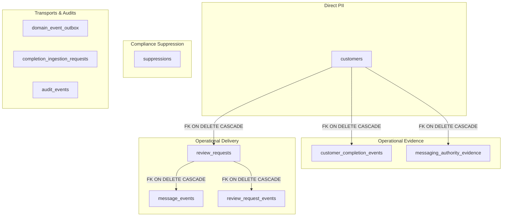
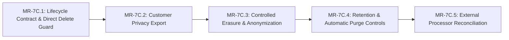

# MR-7C — Privacy Lifecycle Contract & Delete Safety

| Metadata | Value |
|---|---|
| Document | Privacy Lifecycle Contract & Direct Delete Safety Specification |
| Milestone | MR-7 (Trust / Security / Compliance) — Slice MR-7C.1 |
| Status | ACTIVE ENGINEERING CONTRACT (Not Legal Certification) |
| Authoritative Repository | `MPG-Technoologies/MPG-Reputation` |
| Product Baseline | `014ed995e8fccb6be899c68bacfedc65f56b4367` (on `main`) |
| Classification | Internal Engineering Architecture / Public Safe (Synthetic Fixtures Only) |

---

## 1. Purpose & Scope

This document defines the authoritative privacy lifecycle contract, data classification map, and operational invariants for **MPG Reputation**. It establishes the technical boundaries required to handle customer privacy requests (export, erasure, retention) safely without compromising operational integrity, anti-spam suppression, or regulatory evidence.

> [!IMPORTANT]
> **Engineering Contract Notice**: This document specifies technical architectures, database privileges, and lifecycle contracts within the software system. It does **not** constitute legal advice, statutory certification, or final commercial terms of service. Final retention periods, statutory compliance boundaries (GDPR, CCPA/CPRA, HIPAA, CAN-SPAM, CASL, TCPA), and company policies are governed externally in Company OS (`E:\MPG`).

---

## 2. Verified Data Classification & Lifecycle Map

The MPG Reputation data model distributes customer-related data across distinct functional layers. The table below documents the verified schema fields and their privacy classifications:



### A. Direct Customer Data (`public.customers`)
Stores primary customer identities created upon service completion ingestion:
- `id` (UUID): Internal synthetic tenant-isolated primary key.
- `organization_id` (UUID): Tenant boundary.
- `location_id` (UUID): Primary business location reference.
- `first_name` (TEXT): Customer given name.
- `last_name` (TEXT, nullable): Customer family name.
- `email` (TEXT, nullable): Contact email address.
- `phone` (TEXT, nullable): Contact phone number.
- `permission_email` (TEXT): Consent status (`allowed`, `denied`, `unknown`).
- `permission_sms` (TEXT): Consent status (`allowed`, `denied`, `unknown`).
- `permission_source` (TEXT): Attribution source (`quick_complete`, `csv_import`, `crm_webhook`, `pos_integration`, `manual_entry`).
- `created_at`, `updated_at`: Timestamps.

### B. Completion Evidence (`public.customer_completion_events`)
Stores immutable event records establishing that a qualifying transaction or service interaction occurred:
- `id` (UUID): Event identifier.
- `organization_id`, `location_id`, `customer_id`: Operational relations.
- `source`: Completion source (`quick_complete`, `crm_webhook`, `pos_integration`, etc.).
- `source_event_id`: Upstream transaction/event reference.
- `source_customer_id`: External provider customer identifier.
- `source_transaction_id`: External provider transaction/invoice reference.
- `contact` (JSONB): Contact payload snapshot at completion time (`{ email, phone, firstName, lastName }`).
- `permission` (JSONB): Consent assertions snapshot at completion time.
- `country` (VARCHAR(2)): ISO 3166-1 alpha-2 country code.
- `completed_at`, `created_at`: Operational timestamps.

### C. Messaging History (`public.review_requests`, `public.message_events`, `public.review_request_events`)
Stores operational dispatch and interaction lifecycle:
- **`public.review_requests`**:
  - `id`, `organization_id`, `location_id`, `customer_id`, `completion_event_id`, `destination_id`: References.
  - `channel`: `email` or `sms`.
  - `status`: Lifecycle state (`SCHEDULED`, `SENT`, `DELIVERED`, `OPENED`, `CLICKED`, `FAILED`, `CANCELLED`, `SUPPRESSED`).
  - `scheduled_for`, `sent_at`, `delivered_at`, `opened_at`, `clicked_at`, `failed_at`, `cancelled_at`: Timestamps.
  - `tracking_token`, `token_hash`: Cryptographically random 256-bit review redirect tokens (zero PII embedded).
  - `unsubscribe_token`, `unsubscribe_token_hash`: Cryptographically random 256-bit unsubscribe tokens (zero PII embedded).
  - `error_code`, `error_message`: Sanitized delivery failure details.
- **`public.message_events`**:
  - `id`, `review_request_id`, `organization_id`: Operational links.
  - `provider`: Dispatch provider (`resend`, `console`).
  - `provider_event_id`, `provider_message_id`: Downstream webhook IDs.
  - `event_type`: Webhook status (`delivered`, `bounced`, `complained`).
  - `metadata`: Sanitized payload metadata.
- **`public.review_request_events`**:
  - Internal audit transition log (`status_from`, `status_to`, `reason`, `occurred_at`).

### D. Suppression Records (`public.suppressions`)
Enforces universal opt-out, hard-bounce, and complaint suppression:
- `id` (UUID): Suppression record identifier.
- `organization_id` (UUID): Tenant scope.
- `channel` (TEXT): Channel scope (`email` or `sms`).
- `contact_hash` (TEXT): Deterministic SHA-256 digest:
  `sha256(channel + ':' + normalized_contact)`.
- `reason` (TEXT): Ingestion reason (`CUSTOMER_UNSUBSCRIBED`, `HARD_BOUNCE`, `COMPLAINT`, `ADMIN_OVERRIDE`).
- `created_at` (TIMESTAMPTZ): Opt-out recording timestamp.

> [!NOTE]
> **Pseudonymous Data Classification**:
> The `contact_hash` stored in `public.suppressions` is **pseudonymous operational compliance data, not anonymous data**. While it cannot be reversed mathematically, it can be tested for membership given a candidate contact address (`sha256(contact) == contact_hash`). Retaining this record is strictly required under anti-spam regulations (CAN-SPAM, CASL, GDPR Art. 21) to guarantee that unsubscribed individuals are never messaged in subsequent completions.

### E. Authority Evidence (`public.messaging_authority_evidence`)
Immutable audit trail verifying that dispatch authority existed at ingestion time:
- `id`, `organization_id`, `customer_id`, `completion_event_id`: Entity references.
- `channel`: `email` or `sms`.
- `asserted_state`: `allowed`, `denied`, `unknown`.
- `assertion_kind`: `OPERATIONAL_PERMISSION_STATE`.
- `permission_source`, `completion_source`: Ingestion provenance.
- `source_event_id`: External tracking reference.
- `country`: Jurisdiction code.
- `asserted_at`, `observed_at`, `created_at`: Evidence timelines.
- `actor_type`, `actor_id`: Recording entity (`system`).

### F. Transports, Audits & Ingestion
- **`public.domain_event_outbox`**: Minimized in MR-7B.3. For `customer.completed` events, stores strictly the 5 canonical operational identifiers (`eventId`, `organizationId`, `locationId`, `customerId`, `sourceEventId`). Transient transport PII is completely stripped.
- **`public.completion_ingestion_requests`**: Stores `body_hash` (SHA-256) and source metadata. Does **not** persist raw customer contact payloads.
- **`public.audit_events`**: Stores operational audit records with structural IDs and metadata (`actor_id`, `action`, `resource_id`). Excludes customer contact strings.

---

## 3. The Direct Delete Hazard & Cascade Risks

Prior to MR-7C.1, `public.customers` possessed an active Row Level Security policy:
```sql
CREATE POLICY customers_delete ON public.customers
    FOR DELETE TO authenticated
    USING (public.user_has_role(organization_id, ARRAY['OWNER', 'ADMIN']));
```

### The Cascade Hazard
Foreign key constraints defined in the schema link multiple operational, delivery, and audit tables to `public.customers` with `ON DELETE CASCADE`:
1. `public.customer_completion_events.fk_cce_customer`: `REFERENCES public.customers(id, organization_id) ON DELETE CASCADE`.
2. `public.review_requests.fk_rr_customer`: `REFERENCES public.customers(id, organization_id) ON DELETE CASCADE`.
3. Cascading through `review_requests`, all related delivery records in `public.message_events` and `public.review_request_events` are permanently and instantaneously deleted via their respective `ON DELETE CASCADE` constraints.
4. `public.messaging_authority_evidence.fk_mae_customer`: `REFERENCES public.customers(id, organization_id) ON DELETE CASCADE`.

### Consequences of Direct Customer Hard-Delete
If an authenticated tenant `OWNER` or `ADMIN` executed `DELETE FROM customers WHERE id = '...'`:
1. **Destruction of Operational Delivery History**: Legitimate audit records of past dispatches, provider messages, delivery confirmations, and clicks would be destroyed.
2. **Loss of Ingestion and Authority Evidence**: Proof that permission was asserted at completion time (`messaging_authority_evidence`, `customer_completion_events`) would vanish, leaving the business without defense against spam complaints.
3. **Broken Unsubscribe Links**: Historical review request emails previously delivered to the recipient contain unguessable tokens mapped to `review_requests`. Deleting `review_requests` causes any subsequent click on the email's unsubscribe link to fail with `404 Not Found`, stripping the recipient of their ability to opt out.
4. **Suppression Vulnerability**: If the recipient's completion is re-imported later by a CRM sync, the system would treat them as a new customer and re-solicit them because the historical link was destroyed.

### Remediation in MR-7C.1
Migration `20261008010000_mr7c1_customer_delete_guard.sql`:
1. **Drops `customers_delete` policy** on `public.customers`.
2. **Revokes `DELETE` privilege** from `PUBLIC`, `anon`, and `authenticated` roles.
3. **Restricts `DELETE`** strictly to `service_role` (trusted server workflows).

No product UI or client action currently requires direct `DELETE`. This change is purely hardening and causes zero UI breakage.

---

## 4. Frozen MR-7C Invariants

All future privacy and lifecycle engineering slices (MR-7C.2 through MR-7C.5) must strictly adhere to the following invariants:

### INVARIANT 1 — NO UNCONTROLLED HARD DELETE
Tenant roles (`OWNER`, `ADMIN`, `OPERATOR`, `VIEWER`, `anon`) must **never** be permitted to issue direct SQL `DELETE` statements against `public.customers`. Any privacy erasure or customer deletion must be mediated through an audited, server-side workflow executed by `service_role`.

### INVARIANT 2 — SUPPRESSION SURVIVES ERASURE
An erasure operation must **never** delete, weaken, or truncate a suppression record (`public.suppressions`). The pseudonymous `contact_hash` must be preserved indefinitely (or until an explicit, compliant suppression expiration policy is enacted) so that subsequent completion syncs from external CRMs or CSV imports cannot re-subscribe or re-message an individual who opted out or lodged a complaint.

### INVARIANT 3 — ERASURE MUST NOT DESTROY DELIVERY HISTORY BY CASCADE
Privacy erasure must **not** be implemented as a raw database row deletion (`DELETE FROM customers`). The current foreign keys would wipe out completion evidence, messaging history, and authority logs. The erasure workflow must explicitly distinguish between:
- **Erased**: Direct customer PII (names, emails, phones) in `customers` and `customer_completion_events.contact`.
- **Anonymized / Pseudonymized**: Replaced with synthetic redactions (e.g. `[REDACTED]`, synthetic tombstone IDs).
- **Retained**: Operational state, aggregate delivery metrics, anonymized event sequences, and suppression hashes.
- **Aged / Purged**: Bounded records scheduled for eventual archival under future retention policies.

### INVARIANT 4 — UNSUBSCRIBE MUST CONTINUE TO WORK
The current unsubscribe flow relies on the relational path:
$$\text{token} \xrightarrow{} \text{review\_requests} \xrightarrow{} \text{customers} \xrightarrow{\text{email}} \text{suppressions}$$
If a customer record or email address is wiped without decoupling this dependency, existing emails in the recipient's inbox will yield broken unsubscribe links. MR-7C must design an erasure-safe contact-hash linkage (e.g., storing the immutable suppression hash on the review request or completion event) before customer email can be severed.

### INVARIANT 5 — EXPORT PRECEDES DESTRUCTIVE ERASURE IMPLEMENTATION
A complete, structured customer privacy export capability (MR-7C.2) must be implemented and tested before any destructive tenant erasure controls (MR-7C.3) are introduced. This ensures data subjects can access their data without race conditions against irreversible deletion.

### INVARIANT 6 — AUTHORITY / AUDIT HISTORY IS NOT RAW PII STORAGE
Authority evidence (`messaging_authority_evidence`) and audit logs (`audit_events`) exist to prove compliance at dispatch time, not as perpetual secondary repositories of customer PII. When customer records are erased, audit and evidence records must retain only non-PII operational references (`source_event_id`, timestamps, jurisdiction) without storing raw contact identifiers.

### INVARIANT 7 — NO RETENTION PERIODS INVENTED
Engineering slices must **not** invent or hardcode arbitrary statutory retention durations (e.g., "delete after 30 days" or "purge after 7 years"). Specific retention windows depend on commercial contracts, applicable jurisdictions, and legal counsel decisions governed in `E:\MPG`. MR-7C provides the technical capabilities (aging queries, purge jobs); activation and window configuration require explicit owner authority.

### INVARIANT 8 — EXTERNAL PROCESSORS ARE SEPARATE
Local database erasure does **not** automatically purge data from downstream external processors (e.g., Inngest workflow runs, Resend delivery logs, Supabase automated WAL backups, cloud observability logs). The privacy lifecycle contract must treat processor reconciliation as an explicit dependency, documenting processor retention policies and reconciliation APIs separately in MR-7C.5.

---

## 5. Frozen MR-7C Engineering Sequence

The privacy lifecycle capabilities will be implemented in the following strict sequential slices:



1. **MR-7C.1 — Privacy Lifecycle Contract & Direct Delete Safety** *(Current Slice)*:
   - Freeze privacy contract, data classification, and delete hazards.
   - Revoke direct tenant `DELETE` on `public.customers`; grant `DELETE` only to `service_role`.
   - Real PostgreSQL RLS test verification of delete prevention across all roles.
2. **MR-7C.2 — Customer Privacy Export**:
   - Design and build structured export (JSON) of customer records, completions, review requests, and consent logs for an authenticated tenant.
   - Zero-leak cross-tenant isolation and audit logging of export events.
3. **MR-7C.3 — Controlled Customer Erasure & Anonymization**:
   - Decouple unsubscribe flow from direct customer email dependency.
   - Implement audited server-side erasure workflow (`service_role` only).
   - Anonymize direct PII while preserving suppression records and operational delivery invariants.
4. **MR-7C.4 — Retention & Automatic Aging / Purge Controls**:
   - Technical scheduling infrastructure for data aging and purge automation.
   - Parameterized retention policies awaiting owner authorization.
5. **MR-7C.5 — External Processor Reconciliation**:
   - Reconcile external processor copies (Resend, Inngest, backups) in accordance with verified provider APIs and policies.
