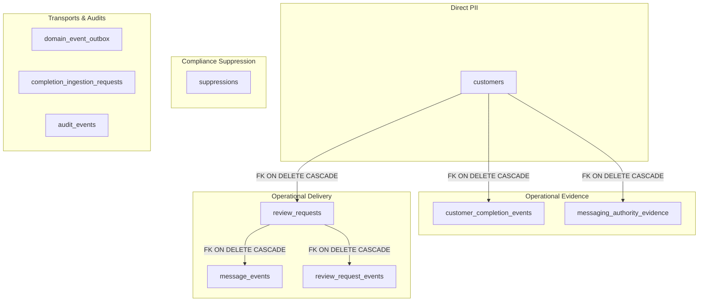
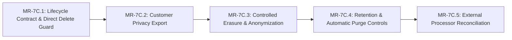

# MR-7C — Privacy Lifecycle Contract & Delete Safety

| Metadata | Value |
|---|---|
| Document | Privacy Lifecycle Contract & Direct Delete Safety Specification |
| Milestone | MR-7 (Trust / Security / Compliance) — Slice MR-7C.1 |
| Status | ACTIVE ENGINEERING CONTRACT (Not Legal Certification) |
| Authoritative Repository | `MPG-Technoologies/MPG-Reputation` |
| Product Baseline | `014ed995e8fccb6be899c68bacfedc65f56b4367` (on `main`) |
| Classification | Internal Engineering Architecture / Public Safe (Synthetic Fixtures Only) |

---

## 1. Purpose & Scope

This document defines the authoritative privacy lifecycle contract, data classification map, and operational invariants for **MPG Reputation**. It establishes the technical boundaries required to handle customer privacy requests (export, erasure, retention) safely without compromising operational integrity, anti-spam suppression, or regulatory evidence.

> [!IMPORTANT]
> **Engineering Contract Notice**: This document specifies technical architectures, database privileges, and lifecycle contracts within the software system. It does **not** constitute legal advice, statutory certification, or final commercial terms of service. Final retention periods, statutory compliance boundaries (GDPR, CCPA/CPRA, HIPAA, CAN-SPAM, CASL, TCPA), and company policies are governed externally in Company OS (`E:\MPG`).

---

## 2. Verified Data Classification & Lifecycle Map

The MPG Reputation data model distributes customer-related data across distinct functional layers. The table below documents the verified schema fields and their privacy classifications:



### A. Direct Customer Data (`public.customers`)
Stores primary customer identities created upon service completion ingestion:
- `id` (UUID): Internal synthetic tenant-isolated primary key.
- `organization_id` (UUID): Tenant boundary.
- `location_id` (UUID): Primary business location reference.
- `first_name` (TEXT): Customer given name.
- `last_name` (TEXT, nullable): Customer family name.
- `email` (TEXT, nullable): Contact email address.
- `phone` (TEXT, nullable): Contact phone number.
- `permission_email` (TEXT): Consent status (`allowed`, `denied`, `unknown`).
- `permission_sms` (TEXT): Consent status (`allowed`, `denied`, `unknown`).
- `permission_source` (TEXT): Attribution source (`quick_complete`, `csv_import`, `crm_webhook`, `pos_integration`, `manual_entry`).
- `created_at`, `updated_at`: Timestamps.

### B. Completion Evidence (`public.customer_completion_events`)
Stores immutable event records establishing that a qualifying transaction or service interaction occurred:
- `id` (UUID): Event identifier.
- `organization_id`, `location_id`, `customer_id`: Operational relations.
- `source`: Completion source (`quick_complete`, `crm_webhook`, `pos_integration`, etc.).
- `source_event_id`: Upstream transaction/event reference.
- `source_customer_id`: External provider customer identifier.
- `source_transaction_id`: External provider transaction/invoice reference.
- `contact` (JSONB): Contact payload snapshot at completion time (`{ email, phone, firstName, lastName }`).
- `permission` (JSONB): Consent assertions snapshot at completion time.
- `country` (VARCHAR(2)): ISO 3166-1 alpha-2 country code.
- `completed_at`, `created_at`: Operational timestamps.

### C. Messaging History (`public.review_requests`, `public.message_events`, `public.review_request_events`)
Stores operational dispatch and interaction lifecycle:
- **`public.review_requests`**:
  - `id`, `organization_id`, `location_id`, `customer_id`, `completion_event_id`, `destination_id`: References.
  - `channel`: `email` or `sms`.
  - `status`: Lifecycle state (`SCHEDULED`, `SENDING`, `SENT`, `DELIVERED`, `CLICKED`, `FAILED`, `CANCELLED`, `SUPPRESSED`).
  - `scheduled_for`, `sent_at`, `delivered_at`, `clicked_at`, `failed_at`, `cancelled_at`, `reminded_at`: Lifecycle timestamps present across the current schema and messaging migrations.
  - `token`, `token_hash`: Review redirect token and hash. The token is random bearer material and contains no embedded customer PII.
  - `unsubscribe_token`, `unsubscribe_token_hash`: Unsubscribe bearer token and hash; the token contains no embedded customer PII.
  - `error_message`: Persisted delivery/workflow failure detail, with application-layer sanitization applied before storage where required.
- **`public.message_events`**:
  - `id`, `review_request_id`, `organization_id`: Operational links.
  - `provider`, `provider_event_id`, `provider_message_id`: Provider identity and downstream event/message identifiers.
  - `event_type`, `status`, `sanitized_error`, `metadata`: Persisted provider/dispatch lifecycle state and sanitized metadata.
  - `event_occurred_at`, `processed_at`, `created_at`: Provider event and processing timestamps.
- **`public.review_request_events`**:
  - Internal request event log keyed by `review_request_id`, with `event_type`, optional `idempotency_key`, `metadata`, and `created_at`.

### D. Suppression Records (`public.suppressions`)
Enforces universal opt-out, hard-bounce, and complaint suppression:
- `id` (UUID): Suppression record identifier.
- `organization_id` (UUID): Tenant scope.
- `channel` (TEXT): Channel scope (`email` or `sms`).
- `contact_hash` (TEXT): Deterministic SHA-256 digest:
  `sha256(channel + ':' + normalized_contact)`.
- `reason` (TEXT): Persisted suppression provenance/reason. Exact values are defined by the active application workflows and are not expanded into a new retention or legal taxonomy in this contract.
- `created_at` (TIMESTAMPTZ): Opt-out recording timestamp.

> [!NOTE]
> **Pseudonymous Data Classification**:
> The `contact_hash` stored in `public.suppressions` is **pseudonymous operational compliance data, not anonymous data**. While it cannot be reversed mathematically, it can be tested for membership given a candidate contact address. The engineering invariant is that suppression evidence survives customer erasure while it is needed to prevent prohibited re-contact. This contract does not declare a statutory retention duration; any expiration or retention window requires explicit owner-approved policy and legal review.

### E. Authority Evidence (`public.messaging_authority_evidence`)
Immutable audit trail verifying that dispatch authority existed at ingestion time:
- `id`, `organization_id`, `customer_id`, `completion_event_id`: Entity references.
- `channel`: `email` or `sms`.
- `asserted_state`: `allowed`, `denied`, `unknown`.
- `assertion_kind`: `OPERATIONAL_PERMISSION_STATE`.
- `permission_source`, `completion_source`: Ingestion provenance.
- `source_event_id`: External tracking reference.
- `country`: Jurisdiction code.
- `asserted_at`, `observed_at`, `created_at`: Evidence timelines.
- `actor_type`, `actor_id`: Recording entity (`system`).

### F. Transports, Audits & Ingestion
- **`public.domain_event_outbox`**: Minimized in MR-7B.3. For `customer.completed` events, stores strictly the 5 canonical operational identifiers (`eventId`, `organizationId`, `locationId`, `customerId`, `sourceEventId`). Transient transport PII is completely stripped.
- **`public.completion_ingestion_requests`**: Stores `body_hash` (SHA-256) and source metadata. Does **not** persist raw customer contact payloads.
- **`public.audit_events`**: Stores operational audit records using `organization_id`, `actor_type`, `actor_id`, `event_type`, `entity_type`, `entity_id`, `metadata`, and `created_at`. Audit metadata is intended to remain privacy-minimized; this contract does not treat the table as a secondary raw-contact store.

---

## 3. The Direct Delete Hazard & Cascade Risks

Prior to MR-7C.1, `public.customers` possessed an active Row Level Security policy:
```sql
CREATE POLICY customers_delete ON public.customers
    FOR DELETE TO authenticated
    USING (public.user_has_role(organization_id, ARRAY['OWNER', 'ADMIN']));
```

### The Cascade Hazard
Foreign key constraints defined in the schema link multiple operational, delivery, and audit tables to `public.customers` with `ON DELETE CASCADE`:
1. `public.customer_completion_events.fk_cce_customer`: `REFERENCES public.customers(id, organization_id) ON DELETE CASCADE`.
2. `public.review_requests.fk_rr_customer`: `REFERENCES public.customers(id, organization_id) ON DELETE CASCADE`.
3. Cascading through `review_requests`, all related delivery records in `public.message_events` and `public.review_request_events` are permanently and instantaneously deleted via their respective `ON DELETE CASCADE` constraints.
4. `public.messaging_authority_evidence.fk_mae_customer`: `REFERENCES public.customers(id, organization_id) ON DELETE CASCADE`.

### Consequences of Direct Customer Hard-Delete
If an authenticated tenant `OWNER` or `ADMIN` executed `DELETE FROM customers WHERE id = '...'`:
1. **Destruction of Operational Delivery History**: Legitimate audit records of past dispatches, provider messages, delivery confirmations, and clicks would be destroyed.
2. **Loss of Ingestion and Authority Evidence**: Proof that permission was asserted at completion time (`messaging_authority_evidence`, `customer_completion_events`) would vanish, leaving the business without defense against spam complaints.
3. **Broken Unsubscribe Links**: Historical review request emails previously delivered to the recipient contain unguessable tokens mapped to `review_requests`. Deleting `review_requests` causes any subsequent click on the email's unsubscribe link to fail with `404 Not Found`, stripping the recipient of their ability to opt out.
4. **Suppression Vulnerability**: If the recipient's completion is re-imported later by a CRM sync, the system would treat them as a new customer and re-solicit them because the historical link was destroyed.

### Remediation in MR-7C.1
Migration `20261008010000_mr7c1_customer_delete_guard.sql`:
1. **Drops `customers_delete` policy** on `public.customers`.
2. **Revokes `DELETE` privilege** from `PUBLIC`, `anon`, and `authenticated` roles.
3. **Restricts `DELETE`** strictly to `service_role` (trusted server workflows).

No product UI or client action currently requires direct `DELETE`. This change is purely hardening and causes zero UI breakage.

---

## 4. Frozen MR-7C Invariants

All future privacy and lifecycle engineering slices (MR-7C.2 through MR-7C.5) must strictly adhere to the following invariants:

### INVARIANT 1 — NO UNCONTROLLED HARD DELETE
Tenant roles (`OWNER`, `ADMIN`, `OPERATOR`, `VIEWER`, `anon`) must **never** be permitted to issue direct SQL `DELETE` statements against `public.customers`. Any privacy erasure or customer deletion must be mediated through an audited, server-side workflow executed by `service_role`.

### INVARIANT 2 — SUPPRESSION SURVIVES ERASURE
An erasure operation must **never** delete, weaken, or truncate a suppression record (`public.suppressions`) merely because direct customer PII is erased. The pseudonymous `contact_hash` must survive erasure while it is needed to prevent prohibited re-contact from later CRM, API, or CSV ingestion. Engineering does not set an indefinite or fixed retention period here; any expiration policy requires explicit owner-approved policy and legal review.

### INVARIANT 3 — ERASURE MUST NOT DESTROY DELIVERY HISTORY BY CASCADE
Privacy erasure must **not** be implemented as a raw database row deletion (`DELETE FROM customers`). The current foreign keys would wipe out completion evidence, messaging history, and authority logs. The erasure workflow must explicitly distinguish between:
- **Erased**: Direct customer PII (names, emails, phones) in `customers` and `customer_completion_events.contact`.
- **Anonymized / Pseudonymized**: Replaced with synthetic redactions (e.g. `[REDACTED]`, synthetic tombstone IDs).
- **Retained**: Operational state, aggregate delivery metrics, anonymized event sequences, and suppression hashes.
- **Aged / Purged**: Bounded records scheduled for eventual archival under future retention policies.

### INVARIANT 4 — UNSUBSCRIBE MUST CONTINUE TO WORK
The current unsubscribe flow relies on the relational path:
$$\text{token} \xrightarrow{} \text{review\_requests} \xrightarrow{} \text{customers} \xrightarrow{\text{email}} \text{suppressions}$$
If a customer record or email address is wiped without decoupling this dependency, existing emails in the recipient's inbox will yield broken unsubscribe links. MR-7C must design an erasure-safe contact-hash linkage (e.g., storing the immutable suppression hash on the review request or completion event) before customer email can be severed.

### INVARIANT 5 — EXPORT PRECEDES DESTRUCTIVE ERASURE IMPLEMENTATION
A complete, structured customer privacy export capability (MR-7C.2) must be implemented and tested before any destructive tenant erasure controls (MR-7C.3) are introduced. This ensures data subjects can access their data without race conditions against irreversible deletion.

### INVARIANT 6 — AUTHORITY / AUDIT HISTORY IS NOT RAW PII STORAGE
Authority evidence (`messaging_authority_evidence`) and audit logs (`audit_events`) exist to prove compliance at dispatch time, not as perpetual secondary repositories of customer PII. When customer records are erased, audit and evidence records must retain only non-PII operational references (`source_event_id`, timestamps, jurisdiction) without storing raw contact identifiers.

### INVARIANT 7 — NO RETENTION PERIODS INVENTED
Engineering slices must **not** invent or hardcode arbitrary statutory retention durations (e.g., "delete after 30 days" or "purge after 7 years"). Specific retention windows depend on commercial contracts, applicable jurisdictions, and legal counsel decisions governed in `E:\MPG`. MR-7C provides the technical capabilities (aging queries, purge jobs); activation and window configuration require explicit owner authority.

### INVARIANT 8 — EXTERNAL PROCESSORS ARE SEPARATE
Local database erasure does **not** automatically purge data from downstream external processors (e.g., Inngest workflow runs, Resend delivery logs, Supabase automated WAL backups, cloud observability logs). The privacy lifecycle contract must treat processor reconciliation as an explicit dependency, documenting processor retention policies and reconciliation APIs separately in MR-7C.5.

---

## 5. Frozen MR-7C Engineering Sequence

The privacy lifecycle capabilities will be implemented in the following strict sequential slices:



1. **MR-7C.1 — Privacy Lifecycle Contract & Direct Delete Safety** *(Current Slice)*:
   - Freeze privacy contract, data classification, and delete hazards.
   - Revoke direct tenant `DELETE` on `public.customers`; grant `DELETE` only to `service_role`.
   - Real PostgreSQL RLS test verification of delete prevention across all roles.
2. **MR-7C.2 — Customer Privacy Export**:
   - Design and build structured export (JSON) of customer records, completions, review requests, and consent logs for an authenticated tenant.
   - Zero-leak cross-tenant isolation and audit logging of export events.
3. **MR-7C.3 — Controlled Customer Erasure & Anonymization**:
   - **MR-7C.3A: Erasure-Safe Unsubscribe Decoupling (Final Access Hardening & Append-Only Invariants)**:
     - **Launch & Pre-Pilot Invariant**: C3A must be deployed to hosted production and verified BEFORE live customer messaging (`ENABLE_LIVE_EMAIL=true`) or any real-customer pilot (MR-8) can be enabled.
     - **Pre-C3A Legacy State**: Pre-C3A review requests lacking immutable evidence in `review_request_recipient_evidence` are treated as synthetic/pre-production legacy state and remain permanently blocked from erasure. Unresolved legacy unsubscribe links are NOT claimed to be erasure-safe.
     - **Strict Append-Only Privileges**: System-owned table `public.review_request_recipient_evidence` grants strictly SELECT and INSERT to `service_role`; UPDATE, DELETE, and TRUNCATE are explicitly revoked. Tenant roles (`OWNER`, `ADMIN`, `OPERATOR`, `VIEWER`, `anon`) have zero access (SELECT, INSERT, UPDATE, DELETE all fail with SQL 42501).
     - **Pre-Invocation Recipient Freezing**: Recipient identity is frozen and bound to `review_request_recipient_evidence` **before the first provider invocation**, guaranteeing immutability across the external side-effect boundary.
     - **Database-Level Defense in Depth**: Trigger `protect_recipient_evidence_immutability` strictly prevents `hash(A) -> hash(B)` overwrites even if table permissions are bypassed.
     - **Initial Send Retries & Reminders**: Verifies stored binding against fresh recipient hash; mismatched recipients are blocked with zero-PII audit reason `RECIPIENT_CHANGED`.
     - **Conservative Legacy Policy**: Zero historical recipient guessing or fallback to mutable `customers.email` or completion snapshots; requests without immutable evidence fail closed safely.
     - **Expanded C3B Erasure Gate**: `checkCustomerErasureEligibility` treats any request without immutable evidence in provider-ambiguous states (`SENDING`, `FAILED`, `SENT`, `DELIVERED`, `CLICKED`, or with `sent_at != null` or `message_events`) as blocking customer erasure (`BLOCKED_BY_UNRESOLVED_LEGACY_REQUESTS`).
   - **MR-7C.3B: Controlled Customer Erasure / Anonymization Engine Foundation (Owner Accepted)**:
     - **Owner Acceptance**: Accepted at commit `856d7b8849b2576b92a4a7bf309cf7149a888c3a`.
     - **Owner Authority Decision (Frozen & Transactionally Enforced)**:
       - Customer erasure / anonymization authority is **OWNER ONLY** (`organization_users.role === 'OWNER'`). `ADMIN`, `OPERATOR`, `VIEWER`, and anonymous requests are denied. Export authority remains unchanged: `OWNER` + `ADMIN`. Foreign-tenant and nonexistent customer targets fail closed without existence leakage.
       - **In-Transaction Authority Enforcement**: The atomic PostgreSQL function `execute_customer_erasure(p_org_id, p_customer_id, p_actor_id, p_actor_type)` directly re-verifies inside the database transaction that `p_actor_id` exists, belongs to `p_org_id`, and currently holds the `'OWNER'` role in `organization_users`. This guarantees immunity from TOCTOU race conditions and prevents `service_role` callers from bypassing OWNER authority.
     - **No Hard Customer Deletes**: The customer row in `public.customers` is retained in-place. Direct `DELETE FROM customers` is strictly forbidden to preserve operational foreign keys without triggering cascade deletion.
     - **Field-Level Erasure, Anonymization & Error Scrub Map**:
       - `customers.first_name`: ANONYMIZE to deterministic non-PII tombstone `'[Deleted Customer]'` (`first_name` is `NOT NULL`).
       - `customers.last_name`: ERASE (`NULL`).
       - `customers.email`: ERASE (`NULL`).
       - `customers.phone`: ERASE (`NULL`).
       - `customers.permission_*`: RETAIN operational compliance state.
       - `customer_completion_events.contact`: ERASE raw PII (`'{}'::jsonb`).
       - `customer_completion_events.source_event_id`: RETAIN (deduplication idempotency key).
       - `review_requests.error_message`: ERASE (`NULL` for erased customer's review requests; scrubs historical provider failure text).
       - `message_events.sanitized_error`: ERASE (`NULL` for message events of erased customer's review requests; scrubs historical error text).
       - `suppressions.contact_hash`: RETAIN byte-for-byte (preserves anti-spam suppression across re-imports).
       - `review_request_recipient_evidence.suppression_contact_hash`: RETAIN byte-for-byte (preserves historical unsubscribe).
       - Operational records (`review_requests`, `message_events`, `review_request_events`, `messaging_authority_evidence`, `audit_events`, `organization_usage`): RETAIN non-PII operational records, status, provider, timestamps, review_request_id.
     - **Durable Tombstone & Database Defense in Depth**:
       - Durable evidence table `public.customer_erasure_records` with append-only access for `service_role` (`SELECT` + `INSERT` only); revoked from `PUBLIC`, `anon`, `authenticated`.
       - Database trigger `protect_erased_customer_immutability` on `public.customers` structurally blocks restoring `email`, `phone`, `last_name`, or changing `first_name` away from `'[Deleted Customer]'` on privacy-erased rows. Non-erased customer editing is unaffected.
     - **Atomic Transactional RPC with In-Transaction Authority Enforcement**:
       - `public.execute_customer_erasure(p_org_id, p_customer_id, p_actor_id, p_actor_type)` plpgsql function runs with `SECURITY DEFINER` and `SET search_path = public, pg_temp`, granted only to `service_role`.
       - Atomically executes in-transaction OWNER authority verification, row locking (`FOR UPDATE`), idempotency verification, legacy recipient evidence gate, erasure record creation, customer PII anonymization, completion event contact redaction, historical error text scrubbing (`review_requests.error_message = NULL` and `message_events.sanitized_error = NULL`), and mandatory zero-PII audit event emission (`privacy.customer_erasure`). Any exception triggers full rollback.
     - **Precondition Legacy Gate**:
       - `checkCustomerErasureEligibility` blocks erasure (`BLOCKED_BY_UNRESOLVED_LEGACY_REQUESTS`) if any review request lacks recipient evidence in provider-ambiguous or delivered states.
   - **MR-7C.3C: External Identifier Erasure Enforcement (Owner Accepted)**:
     - **Authoritative Owner Decision**:
       - MR-7C.3B is **OWNER ACCEPTED**.
       - MR-7C.3C External Identifier Erasure Enforcement is **OWNER ACCEPTED** (Accepted C3C commit: `8796b5e6fb89cea49a96c85917e4808ad5891fa6`).
       - The external identifier policy is **FROZEN & AUTHORITATIVE**:
         - `customer_completion_events.source_customer_id` MUST be erased to `NULL`.
         - `customer_completion_events.source_transaction_id` MUST be erased to `NULL`.
         - `customer_completion_events.source_event_id` MUST be **RETAINED** as the event/idempotency/deduplication key.
         - Hashing or pseudonymization of `source_customer_id` and `source_transaction_id` is NOT approved (hashing is not an approved substitute).
       - **Precise Rationale**: `source_customer_id` and `source_transaction_id` maintain external person/transaction linkability and have no approved post-erasure purpose; `source_event_id` is retained to prevent duplicate ingestion of completed events.
     - **Atomic Transactional Enforcement**:
       - Plpgsql function `public.execute_customer_erasure` updated via migration `supabase/migrations/20261009140000_mr7c3c_external_id_erasure.sql` to atomically set `source_customer_id = NULL` and `source_transaction_id = NULL` alongside `contact = '{}'::jsonb`.
       - Audit event `fields_erased` metadata array updated to include `'source_customer_id'` and `'source_transaction_id'`.
       - Zero non-atomic application-side cleanups; single transactional RPC execution.
       - Schema constraints verified: `source_customer_id` and `source_transaction_id` are nullable (`TEXT NULL`).
       - Preserves all C3B controls: OWNER-only authority, in-transaction role recheck, row locking, idempotency, atomic rollback, suppression and recipient evidence preservation, zero hard deletes.
   - **MR-7C.3C (Delivery): Customer Erasure Delivery Surface (Owner Accepted)**:
     - Exposes the accepted controlled erasure engine (`8796b5e6fb89cea49a96c85917e4808ad5891fa6`) through the authenticated product application.
     - Owner-accepted delivery correction commit: `50e1bcf0fa833d9be16471c3b748a464e9ea5b76`.
     - **Strict OWNER Authority**: Only authenticated organization members with role `'OWNER'` can perform preflight checks or execute customer erasure. `ADMIN`, `OPERATOR`, `VIEWER`, and anonymous requests are denied with safe denied responses.
     - **Single-Customer Boundary & Minimized Attack Surface**: Strictly one customer per request; zero bulk erasure, zero CSV-driven erasure, zero automated purge. Eliminates redundant HTTP API route; delivery is executed exclusively through authenticated Next.js Server Actions.
     - **Preflight Verification**: Preflight action (`checkCustomerErasurePreflightAction`) and domain handler (`handleCustomerErasurePreflight`) verify user authentication, tenant boundaries, customer existence, and legacy recipient evidence gate (`checkCustomerErasureEligibility`).
     - **Explicit Typed Confirmation**: Execution action (`executeCustomerErasureAction`) and domain handler (`handleCustomerErasureExecution`) require explicit confirmation string `'ERASE'`; non-matching confirmations fail closed with `CONFIRMATION_REQUIRED`.
     - **Minimal Non-PII Response Contract**: Returns minimal non-PII operational payload (`{ success: true, status: 'ERASED', erasedAt }`). Customer identifier is strictly omitted from the response. Never leaks raw database errors, SQL statements, stack traces, contact hashes, or provider payloads.
     - **UI Integration & Revalidation**: `CustomerErasureButton` in `src/app/app/customers/customer-actions.tsx` rendered conditionally for OWNERs only in `src/app/app/customers/page.tsx`. Revalidates Next.js path `/app/customers` upon execution to immediately display tombstone state (`[Deleted Customer]`, `—`, `Erased` badge).
     - **Security Isolation**: Browser clients never invoke service-role RPCs directly; server boundaries maintain strict RLS and tenant scoping; database transaction performs final in-transaction authority re-verification.
4. **MR-7C.4 — Retention & Automatic Aging / Purge Controls**:
   - **MR-7C.4A: Retention Requirements + Data-Class Decision Matrix (OWNER ACCEPTED / FROZEN at `924a7f009d18bfeadd0944f5bca082548eac9e54`)**:
     - Authoritative specification: [`docs/MR-7C4-RETENTION-DECISION-MATRIX.md`](./MR-7C4-RETENTION-DECISION-MATRIX.md).
     - **Complete 25-Table Audit**: Classifies all persisted database entities across PII, operational history, security/authority evidence, compliance evidence, financial records, system diagnostics, and tenant configurations.
     - **Catastrophic Cascade Deletion Hazard Identified**: Confirms that hard deleting `customers` (`DELETE FROM public.customers`) triggers an automatic cascade deleting completion events, review requests, message events, recipient evidence (breaking unsubscribe links), regulatory authority evidence (breaking anti-spam compliance proof), and erasure compliance certificates. Hard delete of customer rows is strictly forbidden; data aging must utilize in-place anonymization/redaction tombstones.
     - **Suppression & Unsubscribe Continuity Verified**: `public.suppressions` (keyed by SHA-256 contact hash) and `public.review_request_recipient_evidence` operate independently of mutable customer PII and must survive customer erasure.
     - **12 Explicit Owner Decisions Frozen**:
       - Active customer PII retained until explicit Owner erasure (no automatic customer aging).
       - Completion contact payload redacted after 30 days (`contact = '{}'::jsonb`).
       - Ingestion deduplication key (`source_event_id`) retained permanently.
       - Review link validity window set to 90 days (fails closed, status 410 HTML, unsubscribe remains operational).
       - Unsubscribe capability and recipient evidence retained indefinitely.
       - Messaging authority evidence retained indefinitely.
       - Suppression registry retained permanently per organization.
       - Erasure certificates retained permanently.
       - Audit events retained indefinitely in initial product stage.
       - Financial and usage ledgers retained indefinitely while MR-5 billing is paused.
       - Inactive tenants soft-deactivated only (no hard tenant deletes).
       - Domain event outbox: PENDING never purged; DISPATCHED eligible for purge after 30 days.
   - **MR-7C.4B1: Frozen Retention Controls Foundation (OWNER ACCEPTED at `dd9af1a7630da5c802b10b9c2345b8b525542d63`)**:
     - Implemented initial executable retention controls foundation in `src/domain/privacy/retention-controls.ts`.
     - **Completion Contact Redaction**: `redactAgedCompletionContacts` safely sets `contact = '{}'::jsonb` on completions older than 30 days; preserves `source_event_id`, timestamps, and operational records; records aggregate audit event with zero raw PII.
     - **Review Link Expiration**: `isReviewRequestLinkExpired` in `src/app/r/[token]/route.ts` enforces 90-day validity window from authoritative request timestamp (`sent_at ?? created_at`), rendering a safe, accessible HTTP 410 Gone page with zero internal IDs.
     - **Dispatched Outbox Aging**: `purgeDispatchedDomainOutbox` purges `domain_event_outbox` records where `status = 'DISPATCHED'` and `dispatched_at` is older than 30 days in bounded batches; strictly guards `PENDING` and failed records from deletion; records aggregate audit event.
     - **Permanent-Retention Guards**: Runtime assertion `assertProtectedClassImmunity` and test suite verify all 9 permanent retention classes (`suppressions`, `review_request_recipient_evidence`, `messaging_authority_evidence`, `customer_erasure_records`, `audit_events`, `usage_ledger`, `cost_ledger`, `organization_usage`, `customer_completion_events.source_event_id`) are strictly protected from purge routines.
     - **Test Verification**: 25 domain tests in `test/domain/retention-controls.test.ts` and 15 PostgreSQL integration tests in `test/integration/retention-controls.test.ts`. Zero production scheduler activation.
   - **MR-7C.4B2: Bounded Multi-Tenant Retention Maintenance Workflow (OWNER ACCEPTED at `17ff5bc331b225eb589694607754ac58f30e2473`)**:
     - Implemented server-side bounded coordinator in `src/domain/privacy/retention-maintenance.ts` (`executeMultiTenantRetentionMaintenance`).
     - Scheduled Inngest function in `src/inngest/functions/retention-maintenance.ts` (`retentionMaintenanceWorkflow`) registered via `getInngestFunctions()` in `src/app/api/inngest/route.ts`.
     - **Defense-in-Depth Inngest Registration Boundary**: When `ENABLE_RETENTION_MAINTENANCE !== 'true'`, `retentionMaintenanceWorkflow` is completely omitted from the functions exposed/registered through `/api/inngest`. No retention cron metadata is synchronized or scheduled.
     - **Secondary Runtime/Handler Guard**: If invoked directly while disabled, handler/coordinator immediately returns `SKIPPED_DISABLED` without database mutation.
     - Bounded batch limits: default organization page size 50 (max 200), contact redaction batch 100 (max 500), outbox purge batch 100 (max 500). Deterministic cursor pagination with `id > lastSeenOrgId`.
     - Tenant & failure isolation: executes per tenant, catches per-tenant errors without aborting or rolling back other tenants.
     - **Fixed Safe Failure Categories**: Replaced free-form error strings and regex sanitization with static failure codes (`ORGANIZATION_QUERY_FAILED`, `CONTACT_REDACTION_FAILED`, `OUTBOX_PURGE_FAILED`, `TENANT_MAINTENANCE_FAILED`). Errors contain strictly `{ organizationId, code }`. Zero customer ID, name, email, phone, contact JSON, `source_event_id`, tokens, hashes, outbox payload, SQL query, database connection details, or arbitrary PostgreSQL/Supabase error text.
     - Zero PII aggregate response: returns safe aggregate operational counters only with zero customer PII, secrets, or internal stack traces.
     - Concurrency note: Inngest `concurrency: 1` limits concurrent step execution; because the coordinator runs bounded work within one maintenance step, this serializes execution (not a universal distributed lock).
     - Daily cadence: `'0 3 * * *'` (03:00 UTC) defined as an implementation default. Schedule cadence does not modify frozen MPG retention-policy cutoffs (30-day contacts, 90-day review links, 30-day dispatched outbox; owner-approved MPG product policy, not statutory retention periods).
     - Zero client/browser exposure; system/server boundary only.
     - Preserves soft-deactivation (evaluates ACTIVE, INACTIVE, and SUSPENDED tenants without deleting any organization).
     - Verified across 18 domain unit tests (`test/domain/retention-maintenance.test.ts`) and 5 PostgreSQL integration tests (`test/integration/retention-maintenance.test.ts`).
5. **MR-7C.5 — External Processor Reconciliation**:
   - **MR-7C.5A: External Processor Data Map & Retention / Deletion Contract (ENGINEERING COMPLETE / READY FOR OWNER REVIEW)**:
     - Authoritative specification: [`docs/MR-7C5-EXTERNAL-PROCESSOR-RETENTION-MAP.md`](./MR-7C5-EXTERNAL-PROCESSOR-RETENTION-MAP.md).
     - Comprehensive processor audit across all 5 integrated services: Resend, Inngest, Supabase (AWS us-east-1), Vercel, and Stripe (billing paused). Confirmed zero external processors for Google (destination links only), Twilio (gated), CRM push, or analytics/APM.
     - Complete 4-tier data classification: Direct PII, Pseudonymous/Linkable IDs, Operational Data, Secrets.
     - **Resend Audit**: Direct PII in email envelope/body/subject; correlation tags strictly minimized to `review_request_id`; official retention is 30 days (Free/Pro/Scale) and 7-day backups; no documented public per-message deletion API was verified during MR-7C.5A (official Resend guidance indicates early specific-message removal is support-assisted; Category C — Natural Expiry Only). Content storage controls unverified without plan confirmation (UNVERIFIED / ACCOUNT OR PROVIDER CONFIRMATION REQUIRED).
     - **Inngest Audit & Finding**: Trigger event minimized to 5 IDs in MR-7B.3; **critical finding**: function step return values in `review-request.ts` leak `customerName`, `customerEmail`, and `SendEmailResult` (`renderedSubject`, `renderedBody`) into Inngest Cloud run history (**SECURITY / PRIVACY CORRECTION REQUIRED — MR-7C.5B**); official retention is Free 24h, Pro 7d, Business 14d, Enterprise up to 365d per limits docs (ACCOUNT CONFIGURATION VERIFICATION REQUIRED); no public run trace deletion API was verified (Category C — Natural Expiry Only); remediated action scheduled for MR-7C.5B to strip PII from step outputs.
     - **Supabase Audit & Restoration Hazard**: Host database in AWS us-east-1 with 7–30 day automated backups and continuous WAL PITR; per-record deletion in backups is impossible (Category D — Backup / Disaster-Recovery Copy); identified critical resurrection hazard where restoring a pre-erasure backup would restore erased customer PII.
     - **Restore Privacy Gap & Post-Restore Reconciliation**: Defined mandatory operational invariant: *"A backup restore must never silently resurrect previously erased customer PII or undo suppressions."* Identified explicit **RESTORE PRIVACY GAP**: a backup older than an erasure lacks subsequent erasure certificates and suppression records; documented Case A (pre-restore export delta when pre-restore DB is readable) and Case B (catastrophic DB loss where independent authoritative delta source is currently an architectural gap requiring a later bounded restore-safety slice).
     - **Vercel Audit**: Runtime logs retain data for 1h (Hobby), 1d (Pro), or 3d (Enterprise); no per-record log deletion API was verified (Category C — Natural Expiry Only); HTTP request paths naturally observe review and unsubscribe tokens (`/r/[token]`, `/unsubscribe/[token]`) as **PSEUDONYMOUS / LINKABLE DATA**; ACCOUNT CONFIGURATION VERIFICATION REQUIRED for plan and Observability Plus; recommended C5B hardening for `ConsoleEmailProvider` and error sanitization.
     - **Stripe Audit**: Live billing paused under `MPG-DEC-049`; processes B2B organization payer data only; zero consumer review recipient data. `stripe.customers.del()` deletes billing objects but does not equal complete PII erasure; statutory financial retention applies; distinct scopes must be re-evaluated if live billing resumes.
     - Documented Master Erasure Reconciliation Matrix, Account Evidence Gaps, and non-actions.
   - **MR-7C.5B: External Processor Privacy Hardening & Verification (FUTURE)**:
     - Strip Direct PII from Inngest workflow step return values.
     - Sanitize error logging strings in review request workflows.
     - Add production environment guard on `ConsoleEmailProvider`.
     - Formulate unit tests verifying zero PII in external payloads and serialized step returns.
