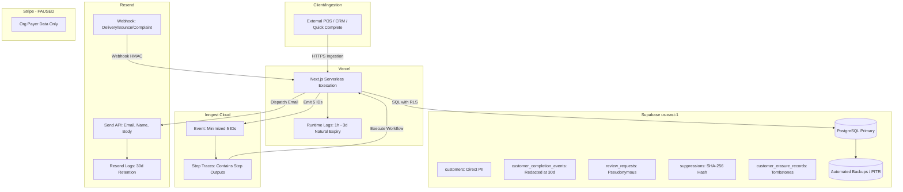

# MR-7C.5A & MR-7C.5B — External Processor Data Map, Retention Contract & Privacy Hardening

| Metadata | Value |
|---|---|
| Document | External Processor Data Map, Retention Windows & Provider Privacy Hardening |
| Milestone | MR-7 (Trust / Security / Compliance) — Slices MR-7C.5A & MR-7C.5B |
| Status | MR-7C.5A — OWNER ACCEPTED (`707f89a072a5593541cfc906e0c19595578bda1c`); MR-7C.5B — ENGINEERING COMPLETE / READY FOR OWNER REVIEW |
| Authoritative Product Repository | `MPG-Technoologies/MPG-Reputation` |
| Authoritative Branch | `chatgpt/mr7c5b-provider-privacy-hardening` |
| Baseline Checkpoint | `707f89a072a5593541cfc906e0c19595578bda1c` (MR-7C.5A OWNER ACCEPTED) |
| Company OS Authority | `E:\MPG` (`techwithmpg/mpg-company-os` at `7df63fb75cc184197b11fcbdeca1b1d333a8e81a`) |
| Governance Scope | `MPG-DEC-038` through `MPG-DEC-049` |
| Public Safe | Yes (Synthetic Fixtures & Architectural Schemas Only) |

---

## 1. Scope & Purpose

This document establishes the authoritative data-flow map, operational retention windows, deletion capabilities, and erasure reconciliation contracts for every external third-party processor that interacts with **MPG Reputation** (`PROD-REP-001`).

Under `MPG-DEC-046` and `MPG-DEC-047`, MPG Reputation is executing a comprehensive market-ready build program (MR-0 through MR-11). Milestones MR-7B (Security Hardening), MR-7C.1 (Privacy Contract & Delete Safety), MR-7C.2 (Customer Privacy Export), MR-7C.3 (Controlled Customer Erasure), and MR-7C.4 (Retention & Automatic Aging / Purge Controls) established strict primary-database privacy boundaries.

Slice **MR-7C.5A** investigates and maps the external processor boundary:
1. Identifying all third-party services that receive, process, store, log, queue, or back up data.
2. Determining what data leaves the MPG primary database and whether it constitutes Direct PII, Pseudonymous/Linkable Data, Operational Telemetry, or Credentials.
3. Documenting verified vendor retention schedules and backup lifecycles.
4. Auditing vendor deletion capabilities (API, SDK, dashboard, support-assisted, or natural expiry).
5. Defining post-restore privacy reconciliation invariants to prevent disaster-recovery backups from resurrecting erased personal data.
6. Identifying privacy leakages requiring code remediation in **MR-7C.5B**.

> [!IMPORTANT]
> **Engineering Contract & Architecture Notice**:
> This document specifies technical architectures, provider capabilities, data flows, and engineering controls. It does **not** constitute legal advice, statutory certification, or final commercial terms of service. Statutory compliance mandates (e.g., GDPR, CCPA/CPRA, CAN-SPAM, CASL, TCPA, HIPAA) and contractual retention floors are governed in Company OS (`E:\MPG`). Provider retention periods documented herein represent vendor operational behaviors, not statutory retention requirements.

---

## 2. Accepted Privacy Invariants & Governance Baseline

All processor mapping and lifecycle reconciliation in this specification adhere strictly to previously established, owner-accepted engineering invariants:

1. **Company OS Governance Supremacy**: Business intent, commercial authorization, and regulatory policies reside in `E:\MPG`. The product repository contains technical implementation code.
2. **Review Integrity Rules (Strictly Enforced)**:
   - Prohibit review gating, positive-only solicitation, fake reviews, paid reviewers, rating prediction filters, or sentiment-conditional incentives.
   - Review requests must remain strictly neutral: *"If you'd like to share your experience, we'd appreciate your honest feedback."*
   - Eligibility never evaluates customer happiness, complaints, or predicted star ratings.
3. **Database Tenant Isolation & RLS**:
   - Every exposed database table has Row Level Security (RLS) enabled.
   - Database tenant isolation is mandatory: users access only rows for organizations where they hold active authorized membership in `organization_users`.
   - Never use editable user metadata for authorization.
4. **Idempotency & Concurrency Invariant**:
   - Ingestion of completion events is strictly idempotent on `(organization_id, source, source_event_id)`.
   - Double-clicks, network retries, and workflow re-executions must never generate duplicate customer requests or duplicate emails.
5. **Open Redirect Prevention**:
   - The tracked link route `/r/[token]` resolves destinations strictly from verified database records. Arbitrary external URLs are rejected.
6. **Frozen C3C External Identifier Erasure Policy (`8796b5e6fb89cea49a96c85917e4808ad5891fa6`)**:
   - Upon customer erasure:
     - `customer_completion_events.source_customer_id` MUST be set to `NULL`.
     - `customer_completion_events.source_transaction_id` MUST be set to `NULL`.
     - Neither field may be hashed or pseudonymized (hashing is not an approved substitute).
     - `customer_completion_events.source_event_id` MUST be **RETAINED** permanently as the deduplication key.
7. **Frozen C4 Launch Retention Policy (`924a7f009d18bfeadd0944f5bca082548eac9e54`)**:
   - Active customer PII: Retained until explicit Owner erasure (no automatic customer PII aging).
   - Completion contact payload: Redacted to `'{}'::jsonb` after 30 days.
   - Ingestion deduplication key (`source_event_id`): Retained permanently.
   - Review request routing links: Expire after 90 days (fails closed, HTTP 410 HTML, unsubscribe remains operational).
   - Unsubscribe capability & recipient evidence: Retained indefinitely.
   - Messaging authority evidence: Retained indefinitely.
   - Suppression registry (`suppressions`): Retained permanently per organization.
   - Erasure certificates (`customer_erasure_records`): Retained permanently.
   - Audit events (`audit_events`): Retained indefinitely in initial product stage.
   - Financial & usage ledgers: Retained indefinitely while MR-5 billing is paused.
   - Inactive tenants: Soft deactivation only (no hard tenant delete).
   - Outbox (`domain_event_outbox`): `PENDING` never purged; `DISPATCHED` eligible after 30 days.
8. **Operational Gating**:
   - Live customer messaging remains strictly **DISABLED** (`ENABLE_LIVE_EMAIL=false`).
   - SMS channel remains strictly **GATED** (no Twilio client, schema-gated only).
   - Billing remains **PAUSED** under `MPG-DEC-049` (`ENABLE_STRIPE_LIVE_BILLING=false`).

---

## 3. Authoritative External Processor Inventory

An exhaustive audit of `package.json`, environment variable specifications, provider abstractions, API routes, webhooks, and background workflows confirms the following five external processors interact with MPG Reputation data:

| Processor Name | Vendor / Entity | SDK / Dependency | Functional Role in MPG Reputation | Customer Data Classification | Active Operational Status |
|---|---|---|---|---|---|
| **Resend** | Resend, Inc. | `resend@6.28.1` | Transactional email delivery, bounce/complaint webhooks, delivery monitoring | Direct PII (Recipient email, first name, message body), Pseudonymous IDs | Configured behind `ENABLE_LIVE_EMAIL=false` gate; active in synthetic test mode |
| **Inngest** | Inngest Inc. | `inngest@4.20.0` | Durable serverless execution, delay queues, event orchestration, retention maintenance | Pseudonymous IDs (Event trigger 5 IDs & hardened step returns; pre-C5B step PII remediated in C5B; run traces retained per plan) | Active local & cloud orchestration; retention cron gated behind `ENABLE_RETENTION_MAINTENANCE=false` |
| **Supabase** | Supabase, Inc. (AWS ap-south-1) | `@supabase/supabase-js@2.116.0`, `@supabase/ssr@0.12.7` | Primary PostgreSQL database, Auth, RLS (Free tier; manual/off-site backups evaluate restore obligations; PITR inactive) | Full Database (Direct PII, Pseudonymous, Operational, Compliance, Audit) | Active primary persistent datastore |
| **Vercel** | Vercel Inc. | `next@16.3.5` | Application hosting, edge compute, serverless route execution, runtime logs | Transient request context, Pseudonymous IDs, Potential logged error text | Active hosting platform |
| **Stripe** | Stripe, Inc. | `stripe@22.6.2` | Subscription billing, checkout sessions, invoice webhooks | Organization billing contact, payment method tokens (Zero end-consumer review data) | Paused under `MPG-DEC-049`; live billing disabled (`ENABLE_STRIPE_LIVE_BILLING=false`) |

### Non-Processor Verification (Audited & Excluded)
- **Google**: MPG Reputation generates destination review links directing customers to Google Business Profiles (via `/r/[token]`). There are **no Google OAuth scopes, no Google API clients, no Google SDKs, and zero customer data transmissions to Google**. Google is a link destination, not a data processor.
- **Twilio**: SMS capabilities are schema-gated. No Twilio package or API client is installed in `package.json`. No data is transmitted to Twilio.
- **CRM / POS Connectors**: Ingestion routes (`/api/v1/completions`) receive inbound webhooks from external systems. MPG Reputation does not push data out to external CRMs (no outbound processor relationship).
- **APM / Error Trackers (Sentry, Datadog, PostHog)**: Audited `package.json`. No external client telemetry, crash reporting, or analytics SDKs are installed.

---

## 4. Data Flow & Classification Map

Data exchanged with external processors is classified into four security tiers:
1. **DIRECT PII**: Unencrypted personal data directly identifying an individual natural person (customer first name, last name, email address, phone number, rendered email body/subject containing personal data).
2. **PSEUDONYMOUS / LINKABLE DATA**: Opaque identifiers that do not reveal identity in isolation but allow record linkage across internal or external datasets (customer UUID, organization UUID, review request UUID, tracking token/hash, recipient evidence contact hash, provider message ID, `source_event_id`).
3. **NON-PII OPERATIONAL DATA**: Generic telemetry, HTTP status codes, error categorizations, event counts, processing timestamps, and aggregate counters.
4. **SECRETS / CREDENTIALS**: API keys, signing secrets, bearer tokens, service role keys, and database connection strings. *Invariant: Secrets must never enter logs, webhook payloads, or event step traces.*

### Data Flow Diagram



---

## 5. Resend Analysis (Transactional Email)

### 5.1 What MPG Sends to Resend
When `ResendEmailProvider.send(input)` executes ([`src/providers/email/resend.ts`](file:///E:/MPG-Reputation/src/providers/email/resend.ts)):
- **Envelope / From**: Configured sender address with business display name (e.g., `"Northstar Dental via MPG Reputation" <reviews@configured-mpg-domain>`).
- **To**: Recipient email address (**Direct PII**).
- **Subject**: Neutral review request subject line, including customer first name and business name (**Direct PII**).
- **Text & HTML Body**: Rendered neutral review request email body, containing customer first name, business name, review tracking link (`/r/[token]`), and unsubscribe link (`/unsubscribe/[token]`) (**Direct PII**).
- **Headers / Reply-To**: Configured tenant reply-to address.
- **Tags**: Strictly minimized internal correlation metadata:
  ```json
  [{ "name": "review_request_id", "value": "<uuid>" }]
  ```
  *Verified Invariant*: No customer name, email, tracking URL, review destination, or organization name is attached to tags.
- **Idempotency Key**: Bounded dispatch idempotency key (`idempotencyKey`).

### 5.2 What Resend Sends to MPG (Webhooks)
Webhook events received at [`/api/webhooks/resend`](file:///E:/MPG-Reputation/src/app/api/webhooks/resend/route.ts):
- `type`: Event type (`email.sent`, `email.delivered`, `email.bounced`, `email.complained`, `email.opened`, `email.clicked`).
- `data.email_id`: Provider message ID (**Pseudonymous**).
- `data.to`: Array of recipient email addresses (**Direct PII** on the wire, verified via HMAC, used to calculate SHA-256 suppression hash, then discarded; not stored in `message_events`).
- `data.tags`: Tag array containing `review_request_id`.
- `data.created_at`: Provider event timestamp.

### 5.3 Resend Operational Retention & Backups
*Official Evidence*: Grounded via Resend API Documentation, Privacy Notice, and Data Processing Addendum (resend.com/docs):
- **Email Body & Delivery Logs Retention**:
  - **Free, Pro, Scale Plans**: **30 days**. All sent email content, recipient metadata, and event logs are permanently deleted 30 days after dispatch.
  - **Enterprise Plan**: Configurable/flexible retention window upon request.
  - **Content Storage Opt-Out**: Resend documentation references optional content storage controls (e.g., disabling message body retention while retaining delivery metadata). However, specific add-on pricing or availability is **UNVERIFIED / ACCOUNT OR PROVIDER CONFIRMATION REQUIRED** as official documentation does not publicly publish a fixed price without plan-specific terms.
- **Backup Retention**: Resend system backups retain data for **7 days**.
- **Post-Account Termination**: If the MPG Resend account is terminated, all remaining customer data is deleted within **90 days**.

### 5.4 Individual Deletion Capability
- **Public REST API**: No documented public per-message deletion API was verified during MR-7C.5A. Official Resend guidance indicates early specific-message removal is support-assisted.
- **Dashboard**: No documented individual per-message deletion button was verified in the dashboard interface.
- **Support-Assisted**: Available upon escalated privacy request to Resend Support (`privacy@resend.com` / `support@resend.com`).
- **Classification**: **Category C — NATURAL EXPIRY ONLY** (30-day operational retention window controls standard data removal; verified: Free / Pro / Scale retention is 30 days, backups 7 days, account-termination deletion within 90 days).

### 5.5 Customer Erasure Relationship
When MPG erases a customer row (`execute_customer_erasure`):
- Resend is **not** immediately invoked via API because no documented public deletion API was verified.
- The external identifier stored in `message_events` is `provider_message_id`.
- The email and message body stored at Resend will naturally expire and be purged by Resend's 30-day lifecycle.
- *Frozen C3C Policy Alignment*: Resend message deletion does not require `source_customer_id` or `source_transaction_id` (both are NULLed in MPG upon erasure). If early manual deletion were escalated to Resend Support, only `provider_message_id` and recipient email address would be required.

---

## 6. Inngest Analysis (Background Orchestration)

### 6.1 What MPG Sends to Inngest (Event Triggers)
In MR-7B.3, the event payload for `customer.completed` was minimized to strictly five opaque identifiers ([`src/inngest/events.ts`](file:///E:/MPG-Reputation/src/inngest/events.ts)):
```json
{
  "name": "customer.completed",
  "data": {
    "eventId": "<uuid>",
    "organizationId": "<uuid>",
    "locationId": "<uuid>",
    "customerId": "<uuid>",
    "sourceEventId": "<string>"
  }
}
```
*Verified Invariant*: The trigger event payload contains zero customer names, email addresses, phone numbers, or contact payloads.

### 6.2 Historical C5A Finding — Remediated in C5B: Step Return Value PII Leakage
During the initial MR-7C.5A repository audit (prior to the MR-7C.5B remediation detailed in Section 13), a source code audit of [`src/inngest/functions/review-request.ts`](file:///E:/MPG-Reputation/src/inngest/functions/review-request.ts) revealed that the **pre-C5B implementation captured Direct PII in Inngest Cloud step execution outputs**.

The code examples below document this **historical, pre-C5B implementation** for audit and governance traceability:

1. **Historical Pre-C5B Step `evaluate-initial-eligibility`**:
   ```typescript
   // HISTORICAL PRE-C5B CODE (Remediated in C5B)
   return {
     eligible: true,
     customerName: eligibility.customer.firstName,  // <-- HISTORICAL PRE-C5B PII
     customerEmail: eligibility.customer.email,      // <-- HISTORICAL PRE-C5B PII
     deliveryChannel: eligibility.deliveryChannel,
   }
   ```
2. **Historical Pre-C5B Step `evaluate-post-delay-eligibility`**:
   ```typescript
   // HISTORICAL PRE-C5B CODE (Remediated in C5B)
   return {
     eligible: true,
     customerName: eligibility.customer.firstName,  // <-- HISTORICAL PRE-C5B PII
     customerEmail: eligibility.customer.email,      // <-- HISTORICAL PRE-C5B PII
     deliveryChannel: eligibility.deliveryChannel,
   }
   ```
3. **Historical Pre-C5B Step `dispatch-review-email`**:
   In pre-C5B code, `dispatch-review-email` returned the complete `SendEmailResult` object returned by `EmailProvider.send()`, which historically included:
   ```typescript
   // HISTORICAL PRE-C5B CODE (Remediated in C5B)
   {
     success: true,
     provider: 'resend',
     messageId: response.data?.id,
     renderedSubject: finalSubject,  // <-- HISTORICAL PRE-C5B PII (Contained customer first name)
     renderedBody: textBody          // <-- HISTORICAL PRE-C5B PII (Contained customer first name, email text)
   }
   ```
4. **Historical Pre-C5B Step `dispatch-review-reminder`**:
   Returned the reminder `SendEmailResult` including `renderedSubject` and `renderedBody` (historical Direct PII).

Because Inngest's execution architecture serializes every `step.run()` return value and stores it in Inngest Cloud run history, customer names, email addresses, and rendered message content were captured in Inngest Cloud run traces under that pre-C5B implementation.

> [!NOTE]
> **REMEDIATED IN MR-7C.5B — IMPLEMENTED & VERIFIED**:
> As documented and verified in Section 13, MR-7C.5B completely stripped Direct PII from MPG-controlled Inngest step return values. MPG steps now return strictly opaque operational status and confirmations (`{ eligible: true, deliveryChannel: 'email' }` and `{ success: true, provider: result.provider }`), while tokens are queried directly by ID from the database within downstream step executions. Direct customer PII remains strictly ephemeral inside step execution closures. Inngest Cloud run traces therefore no longer receive or persist customerName, customerEmail, renderedSubject, or renderedBody.

### 6.3 Inngest Operational Retention & Limits
*Official Evidence*: Grounded via Inngest Documentation (inngest.com/docs/platform/limits):
- **Event & Run Trace History Retention**:
  - **Free Plan**: **24 hours**.
  - **Pro Plan**: **7 days**.
  - **Business Plan**: **14 days**.
  - **Enterprise Plan**: Up to **365 days** according to current general limits documentation.
- **Enterprise Retention Conflict Notice**: Because other Inngest product documentation and pricing materials may cite different Enterprise history windows, record: **ACCOUNT CONFIGURATION VERIFICATION REQUIRED**. Do not freeze an Enterprise retention value for MPG until its actual account/effective configuration is verified.
- **Event Idempotency Key TTL**: **24 hours**.
- **Run Cancellation**: In-flight runs can be cancelled via API (`inngest.runs.cancel`) or Dashboard, but cancellation halts execution—it does not delete historical run logs.
- **Individual Run/Trace Deletion**: No documented public individual run/trace deletion API exists. Inngest provides no API endpoint, SDK method, or dashboard control to delete individual historical runs, events, or step outputs.
- **Classification**: **Category C — NATURAL EXPIRY ONLY**. Data disappears upon expiration of the plan-specific trace retention window.
- **Account Verification Status**: **ACCOUNT CONFIGURATION VERIFICATION REQUIRED**. The exact trace history window (Free: 24h, Pro: 7d, Business: 14d, Enterprise: up to 365d) depends on MPG's active Inngest subscription tier and effective contractual configuration.

### 6.4 Customer Erasure Relationship
- Customer erasure in MPG cannot trigger an individual Inngest run deletion.
- Inngest run data naturally expires according to the plan retention window (ranging from 24 hours on Free, 7 days on Pro, 14 days on Business, up to 365 days on Enterprise per limits documentation; ACCOUNT CONFIGURATION VERIFICATION REQUIRED).
- In MR-7C.5B (implemented and verified), eliminating PII from step return values ensures that Inngest Cloud durable step outputs retain only opaque identifiers, rendering MPG-controlled Inngest run history pseudonymous during its natural expiry window (subject to account plan verification; Inngest is not claimed to store zero data globally).

---

## 7. Supabase Analysis (Database, Backups & PITR)

### 7.1 Primary Database & Storage
- **Project Ref / Name**: `awvqtwkzprygsoyfspuz` (`mpg-reputation`).
- **Region**: AWS `ap-south-1` (Mumbai).
- **Engine**: PostgreSQL 17.6.x managed by Supabase.
- **Plan Tier**: **Free Plan**.
- **Data Stored**: Full MPG Reputation dataset, including `customers`, `customer_completion_events`, `review_requests`, `suppressions`, `customer_erasure_records`, and audit ledgers.
- **Storage Buckets**: Audited schema and application code. MPG Reputation does **not** use Supabase Storage buckets (no customer files, documents, or media stored).

### 7.2 Supabase Backup Architecture & Retention
*Official Evidence & Hosted Verification*:
- **Current Hosted Plan Tier**: The current hosted MPG Reputation project (`mpg-reputation`, `ap-south-1`) is on the **Free** organization plan.
- **Automated Backup & PITR Reality on Current Account**:
  - The current Free-plan hosted project does **not** have the user-accessible 7/14/30-day automated daily backups available on Pro/Team/Enterprise plans.
  - The current account does **not** have the paid Point-in-Time Recovery (PITR) capability active.
  - Provider backup assumptions must be evaluated against the actual account tier.
- **Manual / Off-Site Backups**: Manual exports (`pg_dump`) or off-site backups may later create equivalent restore/privacy reconciliation obligations.
- **Future Tier Invariant**: If MPG upgrades to a tier with automated daily backups (Pro 7d, Team 14d, Enterprise 30d) or continuous WAL PITR, the previously identified restore-resurrection invariant becomes operationally applicable.

### 7.3 Individual Record Deletion in Backups
- **Technical Reality**: Database backups are monolithic, immutable snapshots of the entire relational cluster at a given point in time.
- **Individual Deletion**: **IMPOSSIBLE**. Neither Supabase nor standard relational database technology supports surgically modifying or deleting an individual customer row within an existing historical backup without invalidating cryptographic checksums and WAL continuity.
- **Classification**: **Category D — BACKUP / DISASTER-RECOVERY COPY**.
- **Natural Expiry**: Backup copies naturally cycle out and are overwritten at the end of the backup retention window (7 to 30 days).

### 7.4 The Backup Resurrection Hazard & Privacy Invariant
A critical privacy invariant must be enforced:
> [!CAUTION]
> **CRITICAL PRIVACY INVARIANT**:
> **A backup restore must never silently resurrect previously erased customer PII or undo suppressions.**

If MPG restores a database backup created prior to a customer erasure:
1. The restored database will contain the pre-erasure customer row with original PII (`first_name`, `email`, `phone`).
2. The restored database will lack the `customer_erasure_records` tombstone entry created after the backup timestamp.
3. The restored database will lack any subsequent suppression records added to `public.suppressions` after the backup timestamp.
4. If the application is brought online without reconciliation, erased customers could be contacted, exported, or processed in violation of privacy commitments, and suppressed contacts could receive prohibited messages.

### 7.5 Restore Privacy Gap & Post-Restore Reconciliation Analysis

> [!WARNING]
> **RESTORE PRIVACY GAP — AUTHORITATIVE POST-BACKUP ERASURE/SUPPRESSION DELTA SOURCE REQUIRED**:
> A backup older than an erasure will not contain the later `customer_erasure_records` or later suppression changes. Therefore, the restored database itself cannot be assumed to contain the information required to replay those post-backup actions.

Analysis of disaster-recovery restore scenarios reveals two distinct operational states:

#### Case A — Current / Pre-Restore DB Still Readable
In planned rollbacks or non-catastrophic database rebuilds where the pre-restore production database is still accessible for read-only maintenance queries:
1. **Pre-Restore Delta Export**: Before triggering the database restoration, operators execute a dedicated export query extracting all `customer_erasure_records` and `suppressions` created after the target backup timestamp into a secure, encrypted temporary maintenance artifact.
2. **Database Restore**: Restore the target backup into an isolated maintenance state (`APP_OFFLINE=true`, zero external traffic, background workers disabled).
3. **Reconciliation Replay**: Re-execute `public.execute_customer_erasure()` for each customer in the delta artifact, reapply tombstones and NULLed contacts, and merge all post-backup suppression hashes into `public.suppressions`.
4. **Verification Gate**: Execute automated verification queries ensuring all erased customers have `first_name = '[Deleted Customer]'`, `email IS NULL`, and `phone IS NULL`.
5. **Return to Live Service**: Only after privacy reconciliation passes is the application returned to active service.

> [!NOTE]
> **MR-7C.5C1 IMPLEMENTATION FOUNDATION (CASE A)**:
> - `PrivacyRestoreDeltaV1`: Strongly typed versioned delta schema containing strictly post-backup operational evidence (erasure customer/org IDs, suppression channel/hash pairs, timestamps; zero raw contact PII; suppression contact hashes are retained as pseudonymous privacy evidence needed to verify suppression continuity).
> - `collectPrivacyRestoreDelta`: Server-only collector extracting post-backup erasures and suppressions deterministically from a readable source database within the frozen window (backupCreatedAt, exportedAt] with complete deterministic pagination.
> - `verifyRestoredPrivacyState` & `evaluateRestoreDecision`: Verifies the restored database against the delta with complete pagination across all multi-row queries, confirming all erased customers have tombstoned names, NULLed PII, durable erasure certificates in customer_erasure_records, scrubbed errors, and exact empty completion contact payloads ({}), and confirming all required suppressions exist. Fails closed (`BLOCK_RESTORE_ACTIVATION`) if resurrected PII, missing certificates, or missing suppressions are detected. Returns strictly truthful aggregate safe metrics with zero direct PII.
> - **No Automatic Mutation / Replay in C5C1**: Pure collection + verification. Mutation/replay authority remains in a future bounded slice to preserve security boundaries.

#### Case B — Current DB Unavailable (Catastrophic Loss)
In catastrophic disaster-recovery scenarios where the primary database cluster is completely unavailable or corrupted prior to export:
- **Architecture Gap Identified**: MPG Reputation currently stores erasure certificates (`customer_erasure_records`) and suppression hashes exclusively inside the primary PostgreSQL database. If that cluster is abruptly lost, MPG currently has **no guaranteed independent, offsite authoritative source** of post-backup erasure certificates or suppression deltas.
- **Contractual Boundary**: C5A and C5C1 document this gap as **EXPLICITLY UNRESOLVED**. C5C1 does **not** invent an external offsite storage provider (such as S3, R2, Vercel Blob, secondary DB, or external KMS).
- **Future Milestone Requirement**: Resolving Case B requires a dedicated, bounded restore-safety architecture decision by the Owner (selecting an independent durable offsite privacy ledger/storage boundary) before pilot launch.

```mermaid
sequenceDiagram
    participant Ops as Operations Engineer
    participant SafeDB as Restored DB (Offline Mode)
    participant Delta as Pre-Restore Delta Artifact (Case A)
    participant App as MPG Reputation App

    Note over Ops,SafeDB: Case A: Current DB was readable prior to restore
    Ops->>Delta: Extract post-backup erasure records & suppressions
    Ops->>SafeDB: 1. Restore Database into Isolated Maintenance Mode
    Note over SafeDB: App offline; networking restricted to admin VPC
    Ops->>SafeDB: 2. Replay execute_customer_erasure RPC for all post-backup erasures
    SafeDB-->>SafeDB: Reapply tombstones, NULL contact payloads, scrub error text
    Ops->>SafeDB: 3. Reinsert post-backup suppression hashes into suppressions table
    Ops->>SafeDB: 4. Execute Privacy Verification Audit (Verify no un-tombstoned erased rows)
    SafeDB-->>Ops: Verification passed: Zero resurrected PII
    Ops->>App: 5. Re-enable public routing and background workers
```

---

## 8. Vercel Analysis (Hosting & Runtime Logging)

### 8.1 Hosting, Edge Request Logging & Metadata
- **Platform**: Vercel Serverless / Edge Runtime.
- **Data Transiting**: Next.js route handlers (`/api/v1/completions`, `/api/webhooks/*`, `/r/[token]`, `/unsubscribe/[token]`, Server Actions).
- **HTTP Request Path & Parameter Logging**:
  - Vercel hosting and edge infrastructure automatically captures standard HTTP access and runtime metadata: request method, full URL path, query/search parameters, client IP address, user-agent, and HTTP referrer headers.
  - Review redirect requests (`/r/[token]`) and unsubscribe requests (`/unsubscribe/[token]`) expose:
    - **Review routing token** (`token`)
    - **Unsubscribe token** (`unsubscribe_token`)
  - **Data Classification**: Both tokens are classified as **PSEUDONYMOUS / LINKABLE DATA**. While these tokens are cryptographically random bearer values that contain no embedded customer names or email addresses, they are linkable to internal database records (`review_requests` and `review_request_recipient_evidence`).
  - **Important Privacy Determination**: Production Vercel logs **cannot** be characterized as containing zero sensitive or linkable data merely because application code avoids `console.log(pii)`. The infrastructure access log inherently records pseudonymous and linkable URL paths and parameters.
- **Runtime Log Retention Schedules** (*Official Evidence via vercel.com/docs*):
  - **Hobby Plan**: **1 hour**.
  - **Pro Plan**: **1 day** (or **30 days** if Observability Plus is enabled).
  - **Enterprise Plan**: **3 days** (or **30 days** if Observability Plus is enabled).
  - **Log Drains**: If configured, real-time logs can be forwarded to external observability endpoints (Datadog, S3, Axiom). *Verified*: No Log Drains are configured in the MPG repository.
- **Account Verification Status**: **ACCOUNT CONFIGURATION VERIFICATION REQUIRED** (confirm whether MPG is on Pro, Pro + Observability Plus, or Enterprise, and verify Log Drain status).

### 8.2 Repository Logging Audit
An exhaustive search for `console.log`, `console.error`, and `console.warn` across `src/` yielded the following findings:
1. **`ConsoleEmailProvider`** ([`src/providers/email/console.ts`](file:///E:/MPG-Reputation/src/providers/email/console.ts)):
   - Logs `To: ${input.to}`, `Subject: ${finalSubject}`, and `Body: ${body}` directly to console.
   - *Assessment*: This provider is designed strictly for local offline development. In staging or preview environments on Vercel, if `ConsoleEmailProvider` were selected, raw customer PII would be written to Vercel runtime logs.
   - *C5B Hardening (Implemented in MR-7C.5B)*: Added an immediate fail-closed environment assertion in `ConsoleEmailProvider` throwing `CONSOLE_EMAIL_PROVIDER_DISABLED_IN_PRODUCTION` if `NODE_ENV === 'production'`.
2. **Production API & Webhook Routes**:
   - [`/api/webhooks/resend`](file:///E:/MPG-Reputation/src/app/api/webhooks/resend/route.ts): Logs status codes, event types, and error strings (`dedupErr.message`, `casResult.error`). Does not log raw request bodies or customer contact fields.
   - [`/api/webhooks/stripe`](file:///E:/MPG-Reputation/src/app/api/webhooks/stripe/route.ts): Logs operational status and payload conflict events without personal data.
   - [`/r/[token]`](file:///E:/MPG-Reputation/src/app/r/[token]/route.ts): Logs generic error messages without query parameters.
   - [`/domain/completion/api-handler.ts`](file:///E:/MPG-Reputation/src/domain/completion/api-handler.ts): Logs operational stage failures with error codes. Raw contact payloads are not logged.
3. **Inngest Review Request Functions** ([`src/inngest/functions/review-request.ts`](file:///E:/MPG-Reputation/src/inngest/functions/review-request.ts)):
   - Line 1064: `console.error('Email dispatch error; marking review request FAILED for retry:', errorMsg)`.
   - *Risk Assessment*: If Resend returns an error string echoing the recipient's email address (e.g., `"Invalid email address: customer@example.com"`), unhandled `errorMsg` could carry customer PII into Vercel runtime logs.
   - *C5B Hardening (Implemented in MR-7C.5B)*: Added `classifySafeDispatchError` in `review-request.ts` to enforce static categorized error labels and strip email, name, phone, token, and secret patterns before logging or rethrowing.

### 8.3 Individual Deletion in Vercel Logs
- **Public API / CLI / Dashboard**: **NOT AVAILABLE**. Vercel does not support deleting individual log lines from runtime logs.
- **Classification**: **Category C — NATURAL EXPIRY ONLY** (expires within 1 hour to 3 days depending on plan).

---

## 9. Stripe Analysis (Billing & Payments — PAUSED)

### 9.1 Role & Status in MPG Reputation
- **Milestone Status**: Milestone MR-5 (Commercial Infrastructure / Billing) is **PAUSED** under `MPG-DEC-049`.
- **Operational Gate**: Live billing is disabled in code:
  `ENABLE_STRIPE_LIVE_BILLING !== 'true'`
  Webhook handler rejects live events with HTTP 503 (`Live billing is disabled`).
- **Data Scope**: Stripe processes **organization billing entities** (B2B tenant subscription contacts, corporate credit cards, billing addresses). **Stripe never receives, processes, or stores end-consumer review recipients (`customers` table)**.

### 9.2 Retention & Deletion Capabilities & Distinct Scope Notice
*Official Evidence via stripe.com/docs/privacy/deletion-requests*:
- **API Object Deletion vs. Complete Redaction**:
  - The API endpoint `stripe.customers.del(customerId)` deletes the customer object from active billing operations (e.g., detaching payment methods, preventing new subscriptions). However, Stripe retains the underlying customer record for historical transaction reporting and API reference.
  - Calling `stripe.customers.del()` does **not** equal complete personal-data erasure.
  - Permanent personal data removal requires dedicated Stripe **Dashboard Redaction Jobs** or authenticated consumer privacy requests, which redact personal identifiers while preserving statutory financial records.
- **Statutory Financial Retention**: Stripe is legally required under anti-money laundering (AML), tax, and financial regulations to retain transaction ledgers, invoices, and payment dispute histories for statutory retention periods (typically 5 to 7 years).
- **Scope Re-evaluation Requirement**: Stripe object deletion and privacy/redaction mechanisms operate on different scopes and have distinct compliance effects. If MPG live billing is resumed in a future milestone, Stripe customer lifecycle, deletion, and redaction procedures must be comprehensively re-evaluated.
- **Operational Boundary**: Billing remains **PAUSED** under `MPG-DEC-049`. No Stripe implementation, live billing activation, or deletion calls are authorized here.
- **Customer Erasure Impact**: End-consumer customer erasure in MPG Reputation has **zero relationship with Stripe**, because consumer review recipients never enter Stripe.

---

## 10. Master External Processor Erasure & Retention Matrix

The table below synthesizes the complete retention and deletion architecture across all external processors:

| Processor | Data Sent | PII Level | Primary Retention Window | Backup Retention Window | Individual Deletion Available? | Deletion Mode | Erasure Action Required? | Evidence Level | Remaining Risk / Note |
|---|---|---|---|---|---|---|---|---|---|
| **Resend** | Recipient email, first name, rendered review email body & subject, tags (`review_request_id`) | **DIRECT PII** | 30 days (Free/Pro/Scale); Configurable (Enterprise) | 7 days | **No public deletion API verified** (Support-assisted for specific early removal) | **Category C** (Natural Expiry Only) | **None** (Expires naturally at 30 days) | **VERIFIED — OFFICIAL DOC** | Content storage controls unverified without plan confirmation (UNVERIFIED / ACCOUNT OR PROVIDER CONFIRMATION REQUIRED). Manual early specific-message deletion requires Resend Support. |
| **Inngest** | Event trigger (5 opaque IDs); Hardened step outputs (opaque confirmations only; pre-C5B customerName/customerEmail/renderedSubject/renderedBody removed) | **PSEUDONYMOUS / OPAQUE RUN TRACES** (MPG step returns stripped of Direct PII in C5B; run traces retained per plan) | Free 24h, Pro 7d, Business 14d, Enterprise up to 365d per limits docs (ACCOUNT CONFIGURATION VERIFICATION REQUIRED) | N/A (Cloud state) | **No public deletion API verified** (Cancellation only; no run trace deletion API) | **Category C** (Natural Expiry Only) | **IMPLEMENTED / VERIFIED in MR-7C.5B** (PII stripped from durable step returns) | **VERIFIED — REPOSITORY & OFFICIAL DOC** | Pre-C5B step PII leakage remediated in C5B. Inngest retains pseudonymous run traces during natural expiry. ACCOUNT CONFIGURATION VERIFICATION REQUIRED for active plan/run history limits; do not claim Inngest globally stores zero data. |
| **Supabase** | Full relational database (customers, completions, requests, suppressions, evidence, ledgers) | **DIRECT PII** (Primary Store) | Retained until explicit erasure or lifecycle aging | Free plan (no user-accessible 7/14/30d automated backups; PITR inactive; manual backups or future tier upgrades evaluate Category D) | **YES (Primary DB)**; **NO (Backups)** | **Category A (Primary)**; **Category D (Backups / Manual Dumps)** | **Primary DB**: `execute_customer_erasure` RPC. **Backups**: Post-Restore Reconciliation. | **VERIFIED — HOSTED EVIDENCE (Free / ap-south-1 / PG 17.6) & DOCS** | Restoring an old backup could resurrect erased PII unless Post-Restore Reconciliation is executed. RESTORE PRIVACY GAP identified for Case B. |
| **Vercel** | Request URLs, path tokens (`/r/[token]`, `/unsubscribe/[token]`), headers, console log output, error traces | **PSEUDONYMOUS / LINKABLE DATA & ERROR LOGS** | 1h (Hobby), 1d (Pro), 3d (Enterprise); 30d (Observability Plus) | N/A | **No per-record log deletion API verified** | **Category C** (Natural Expiry Only) | **None** (Logs expire naturally; error logging sanitized in MR-7C.5B) | **VERIFIED — OFFICIAL DOC** | URL paths log pseudonymous review/unsubscribe tokens. `ConsoleEmailProvider` blocked in production; dispatch errors sanitized via `classifySafeDispatchError`. ACCOUNT CONFIGURATION VERIFICATION REQUIRED for plan/Observability Plus. |
| **Stripe** | Tenant billing contacts, payment tokens, invoices (Zero review customer data) | **B2B PII / FINANCIAL** | Retained per active subscription + statutory tax/AML retention | Per Stripe infrastructure | **Object deletion available (`stripe.customers.del()`); Redaction jobs separate** | **Category A** (Programmatic API Delete) | **None** (End-consumer reviews never enter Stripe; billing paused) | **VERIFIED — OFFICIAL DOC** | `stripe.customers.del()` does not equal complete PII erasure; statutory tax/AML retention applies. Live billing paused under `MPG-DEC-049`. Re-evaluate if live billing resumes. |

---

## 11. Deletion Mode Classification & Architectural Policies

Every copy of data outside the primary database table row is classified into one of five standard deletion modes:

### Mode A — Immediate Programmatic Delete Available
- **Definition**: The provider exposes an official, supported REST API or SDK method allowing MPG to programmatically delete an individual record upon demand.
- **Processors**: Supabase primary database (`DELETE` / RPC update), Stripe (`stripe.customers.del()` for billing objects; subject to distinct redaction and statutory financial retention scopes).

### Mode B — Manual / Support-Assisted Delete
- **Definition**: Programmatic per-record deletion is not exposed via API, but individual record erasure can be performed via administrative dashboard or by submitting an authenticated request to vendor data protection/support teams.
- **Processors**: Resend (escalated requests to `privacy@resend.com` for specific early message purge), Stripe (Dashboard Redaction jobs).

### Mode C — Natural Expiry Only
- **Definition**: The provider provides no per-record deletion mechanism whatsoever. All data persisted by the provider disappears automatically upon expiration of the provider's fixed operational retention window.
- **Processors**: Resend (30-day email & log lifecycle; 7-day backups), Inngest (Free 24h, Pro 7d, Business 14d, Enterprise up to 365d per limits docs; ACCOUNT CONFIGURATION VERIFICATION REQUIRED), Vercel (1h to 3d runtime logs).
- **MPG Policy**: MPG relies on natural provider expiration for transient delivery and orchestration traces, provided the underlying payload is minimized and no long-term profiling occurs.

### Mode D — Backup / Disaster-Recovery Copy
- **Definition**: Monolithic, immutable backup copies that cannot be modified on an individual record basis. Data expires as backup cycles roll over (7 to 30 days).
- **Processors**: Supabase manual/future automated backups or PITR archives (Free plan currently inactive for automated/PITR), Resend system backups (7 days).
- **MPG Policy**: Immutable backups are protected by the **Post-Restore Privacy Reconciliation Procedure** (Section 7.5). Backups are never altered directly; instead, restored environments are reconciled before entering service.

### Mode E — Must Not Contain PII
- **Definition**: Architectural boundary where personal data is strictly prohibited from entering.
- **Processors**: Inngest event triggers (enforced in MR-7B.3), Vercel production logs, Resend correlation tags.
- **MPG Policy**: Any personal data identified in a Mode E component represents an architectural defect requiring remediation.

---

## 12. Provider Account Evidence Gaps & Owner Verification Requirements

Where vendor retention periods depend on specific plan configurations or account settings that cannot be safely inspected from local source code, they are recorded as **ACCOUNT CONFIGURATION VERIFICATION REQUIRED**:

| Provider | Configuration Item to Verify | Impact on Data Retention | Action Required by Owner Prior to Launch |
|---|---|---|---|
| **Resend** | Active Subscription Tier (Free, Pro, Scale, or Enterprise) | Determines whether email/log retention is strictly 30 days or custom | Verify in Resend Dashboard -> Billing. |
| **Resend** | Message Content Storage Controls | When active, prevents Resend from storing email body content | UNVERIFIED / ACCOUNT OR PROVIDER CONFIRMATION REQUIRED (pricing and availability terms require account confirmation). |
| **Inngest** | Active Plan Tier (Free, Pro, Business, or Enterprise) | Determines run trace retention (Free 24h, Pro 7d, Business 14d, Enterprise up to 365d) | Verify in Inngest Cloud Dashboard -> Organization Settings (ACCOUNT CONFIGURATION VERIFICATION REQUIRED). |
| **Supabase** | Hosted Plan Confirmed (Free; ap-south-1; PG 17.6.x); Upgrade Evaluation | Current Free tier has no automated daily backup retention or PITR. Future upgrade would activate 7d/14d/30d backup lifecycle | Re-evaluate if organization upgrades to Pro/Team/Enterprise or institutes off-site manual backups. |
| **Vercel** | Active Plan Tier (Pro vs Enterprise) & Observability Plus | Determines runtime log retention (1d vs 3d vs 30d) | Verify in Vercel Dashboard -> Project Settings -> Observability. |
| **Stripe** | Account Eligibility & Verification (MR-5 dependency) | Prerequisites for unpausing commercial billing under `MPG-DEC-049` | Remains paused; resolve independently before MR-8. |

---

## 13. MR-7C.5B Engineering Implementation & Privacy Hardening

The privacy leakage remediation identified in MR-7C.5A was implemented and verified in **MR-7C.5B**:

1. **Inngest Step Return Value Minimization**:
   - `evaluate-initial-eligibility` and `evaluate-post-delay-eligibility` in [`src/inngest/functions/review-request.ts`](file:///E:/MPG-Reputation/src/inngest/functions/review-request.ts) return strictly minimal orchestration data:
     ```typescript
     { eligible: boolean, deliveryChannel: 'email', destinationId?: string }
     ```
     `customerName`, `customerEmail`, `businessName`, and `reviewReplyToEmail` are completely stripped from step outputs.
   - `create-or-resolve-review-request` returns `{ reviewRequestId, isNew, status }`. Direct `token` and `unsubscribeToken` are stripped from durable step return and workflow scope. Downstream steps query tokens directly from the PostgreSQL source of truth by `reviewRequestId`.
   - `dispatch-review-email` and `dispatch-review-reminder` return strictly:
     ```typescript
     { success: true, provider: result.provider }
     ```
     (or safe idempotent skip `{ success: true, alreadySent: true, provider: 'idempotent_skip' }` / abort `{ success: false, aborted: true, provider: 'abort' }`).
   - `SendEmailResult` in [`src/providers/email/types.ts`](file:///E:/MPG-Reputation/src/providers/email/types.ts), `ConsoleEmailProvider` ([`src/providers/email/console.ts`](file:///E:/MPG-Reputation/src/providers/email/console.ts)), and `ResendEmailProvider` ([`src/providers/email/resend.ts`](file:///E:/MPG-Reputation/src/providers/email/resend.ts)) stripped `renderedSubject` and `renderedBody`. Neither email subject nor body is ever persisted in Inngest Cloud durable state.
2. **Error Logging & Exception Sanitization**:
   - Introduced `classifySafeDispatchError` in [`src/inngest/functions/review-request.ts`](file:///E:/MPG-Reputation/src/inngest/functions/review-request.ts) enforcing static, safe operational failure categories (`RATE_LIMIT_EXCEEDED`, `Transient provider 429 Too Many Requests`, `EMAIL_DISPATCH_FAILED`, `REMINDER_DISPATCH_FAILED`).
   - Collapses arbitrary provider errors to safe categories before passing to `console.error`, `audit_events`, `message_events`, or rethrown Inngest retry exceptions.
   - Eliminates potential leakage of customer emails, names, phone numbers, tokens, UUIDs, payload hashes, and secrets in error traces.
3. **Fail-Closed Production Guard on `ConsoleEmailProvider`**:
   - In [`src/providers/email/console.ts`](file:///E:/MPG-Reputation/src/providers/email/console.ts), added immediate fail-closed guard:
     ```typescript
     if (process.env.NODE_ENV === 'production') {
       throw new Error('CONSOLE_EMAIL_PROVIDER_DISABLED_IN_PRODUCTION')
     }
     ```
     Throws before any email rendering, address formatting, or console logging occurs, preventing accidental leakage in hosted production environments while preserving synthetic local/test execution.
4. **Focused Verification Test Suite**:
   - 19 focused tests in [`test/integration/mr7c5b-provider-privacy-hardening.test.ts`](file:///E:/MPG-Reputation/test/integration/mr7c5b-provider-privacy-hardening.test.ts) proving:
     1. Initial eligibility contains no customerName
     2. Initial eligibility contains no customerEmail
     3. Post-delay eligibility contains no name/email
     4. Review dispatch contains no renderedSubject
     5. Review dispatch contains no renderedBody
     6. Reminder dispatch contains no rendered content
     7. Provider error containing email does not leak
     8. Provider error containing name/phone does not leak
     9. Provider error containing review token does not leak
     10. Provider error containing unsubscribe token does not leak
     11. Provider error containing long hash/UUID does not leak unnecessarily
     12. ConsoleEmailProvider fails before logging in production
     13. ConsoleEmailProvider remains usable locally
     14. Successful send still works
     15. Reminder still works
     16. Suppression still works
     17. Unsubscribe still works
     18. Authority/sender checks still work
     19. Retry/idempotency behavior remains correct
   - 13 tests in [`test/providers/email.test.ts`](file:///E:/MPG-Reputation/test/providers/email.test.ts).

> [!IMPORTANT]
> **Explicit Separation of Backup-Restore Privacy Gap**:
> The disaster recovery backup-restore privacy gap (Case B catastrophic DB loss documented in Section 11) is **not** addressed in MR-7C.5B and remains explicitly unresolved and separate. MR-7C.5B addresses application-controlled Inngest and email provider data minimization and error safety only.

---

## 14. Manual & Provider-Support Actions

If an individual data subject exercises an out-of-cycle right to immediate erasure that cannot await natural 30-day provider expiration:
1. **Primary Database**: Execute standard OWNER-authenticated customer erasure via Next.js Server Action (`executeCustomerErasureAction`).
2. **Resend Escalation**: If the customer specifically demands erasure of email logs prior to the 30-day window:
   - Locate the relevant `provider_message_id` values from `public.message_events` associated with the customer's historical review requests.
   - Submit an authenticated request to `privacy@resend.com` citing the Message IDs and requesting immediate purge of email logs.
3. **Account Termination Protocol**:
   - In the event of MPG Reputation decommissioning, submit account termination requests to Resend (triggers 90-day complete purge), Inngest, and Supabase.

---

## 15. Deferred Legal & Commercial Decisions

The following items are outside the technical scope of MR-7C.5A and are deferred to Owner and Company OS governance:
1. **Resend Content Storage Option**: Deciding whether to configure or purchase message content storage controls on Resend (UNVERIFIED / ACCOUNT OR PROVIDER CONFIRMATION REQUIRED).
2. **Statutory Retention Policies**: Determining statutory compliance durations under GDPR Article 17, CCPA § 1798.105, CAN-SPAM Act, and CASL (governed in `E:\MPG`).
3. **Inngest Enterprise Retention Term**: Selecting the contractual retention term if an Inngest Enterprise agreement is negotiated.
4. **Resumption of MR-5 Billing**: Billing provider account eligibility and KYC verification remain paused under `MPG-DEC-049`.

---

## 16. Explicit Non-Actions in MR-7C.5A

To maintain strict boundary integrity and preserve production safety, the following actions were **NOT** performed in MR-7C.5A:
- **Zero Live Deletions**: No Resend emails or logs were deleted. No Inngest runs or events were deleted. No Supabase records or backups were deleted. No Vercel logs were altered.
- **Zero Provider Setting Changes**: No settings, retention windows, or webhook URLs were modified in Resend, Inngest, Supabase, Vercel, or Stripe.
- **Zero Plan Upgrades/Downgrades**: No provider subscriptions or billing plans were changed.
- **Zero Credential Changes**: No API keys, signing secrets, or database credentials were added, rotated, or exposed.
- **Zero Production Environment Variable Changes**: No hosted environment variables were modified.
- **Zero Hosted Migrations or Deployments**: No database migrations were executed against hosted Supabase; no code was deployed to Vercel.
- **Zero Invariant Weakening**: All C3B/C3C erasure invariants and C4 retention policies remain 100% intact.
