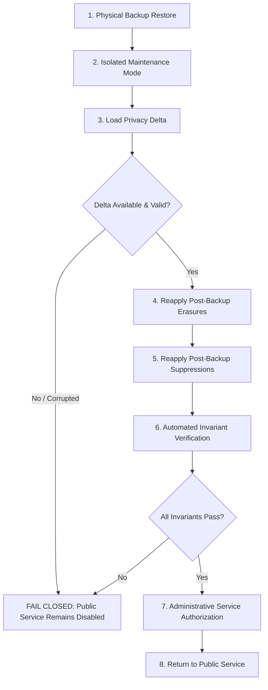

# MR-7C.5C — Disaster-Recovery Privacy Reconciliation Specification

| Metadata | Value |
|---|---|
| Document | Disaster-Recovery Backup Restore Privacy Reconciliation Architecture & Requirements |
| Milestone | MR-7 (Trust / Security / Compliance) — Slice MR-7C.5C |
| Status | REQUIREMENTS / DESIGN ONLY (No Implementation Authorized) |
| Authoritative Product Repository | `MPG-Technoologies/MPG-Reputation` |
| Baseline Checkpoint | `fcf8f81fa709cedc0a9ec3f46d68f90fbed06c84` (on `main`) |
| Governance Scope | `MPG-DEC-038` through `MPG-DEC-050` |
| Public Safe | Yes (Synthetic Architectural Specification Only) |

---

## 1. Purpose

The objective of **MR-7C.5C** is to establish authoritative architectural requirements to **prevent restored backups from silently resurrecting erased customer personal data (PII) or undoing post-backup anti-spam suppressions**.

In an enterprise database environment with automated or point-in-time recovery (PITR) backups, restoring a database snapshot reverts the state of tables to the timestamp of the backup. If an individual customer exercised an owner-approved right to erasure (under MR-7C.3) or opted out of communications (suppression under MR-7B.1 / MR-7C.3A) *after* that backup was taken, a naive restore of the backup snapshot will:
1. **Resurrect Erased Direct PII**: Reinstate customer names, email addresses, phone numbers, and raw completion contact payloads that were legally anonymized or erased.
2. **Resurrect External Identifiers**: Reinstate external person/transaction linkability (`source_customer_id`, `source_transaction_id`) erased under MR-7C.3C.
3. **Strip Anti-Spam Suppressions**: Revert `public.suppressions` and `public.review_request_recipient_evidence` rows, risking illegal re-solicitation and violating CAN-SPAM, CASL, and FTC review-integrity rules.

MR-7C.5C defines the engineering invariants, data minimization principles, security boundaries, and fail-closed reconciliation lifecycle required to close this gap in future implementations.

> [!IMPORTANT]
> **Requirements / Design Only**:
> This document defines requirements and conceptual options only. **No disaster-recovery infrastructure, no third-party services, no database migrations, and no automatic restore mechanisms are authorized or implemented in this slice.**

---

## 2. Failure Cases & Architectural Gap Analysis

### Case A: Controlled Recovery (Primary Database Remains Readable Before Restore)
- **Scenario**: The primary database suffered a non-catastrophic failure (e.g., localized corruption, operator schema error, application regression, data loss in a specific tenant or table), but the primary database instance remains online, authenticated, and readable.
- **Requirement**: The system MUST securely extract an authoritative **Post-Backup Privacy Delta** directly from the live primary tables (`public.customer_erasure_records`, `public.suppressions`, `public.review_request_recipient_evidence`, and `public.audit_events`) *prior* to executing the restore.
- **Feasibility**: High feasibility using standard database dump/query protocols over secure administrative connections.

### Case B: Catastrophic Loss (Primary Database Destroyed or Unreadable)
- **Scenario**: The primary database host, region, or disk subsystem is completely destroyed, compromised, permanently corrupted, or unavailable without any pre-restore read access.
- **Current State**: In the current MPG Reputation architecture, customer erasures and suppressions are persisted solely within the primary PostgreSQL database in Supabase (`awvqtwkzprygsoyfspuz`). If that database is destroyed, all erasures and suppressions enacted since the last valid backup exist only in ephemeral application/provider logs (which themselves are scrubbed of PII and lack complete relational integrity).
- **Authoritative Status**:
  ```
  RESTORE PRIVACY GAP — UNRESOLVED
  ```
  No independent, authoritative source outside the primary database currently guarantees the recovery and replay of post-backup privacy deltas.

---

## 3. Restore Invariants

A restored MPG Reputation environment **MUST NOT** return to public or customer-facing service until all of the following invariants are deterministically verified:

1. **Reapply Post-Backup Erasures**: All erasure actions recorded in the privacy delta that occurred between the backup timestamp $T_{backup}$ and the failure timestamp $T_{failure}$ must be completely reapplied to the restored database.
2. **Reapply Post-Backup Suppressions**: All suppressions created between $T_{backup}$ and $T_{failure}$ must be re-inserted into `public.suppressions` and verified against `public.review_request_recipient_evidence`.
3. **No PII Resurrection**:
   - `customers.first_name` remains `'[Deleted Customer]'` for all erased subjects.
   - `customers.last_name`, `customers.email`, and `customers.phone` remain `NULL`.
   - `customer_completion_events.contact` remains `'{}'::jsonb`.
4. **External Identifier Erasure Preservation**:
   - `customer_completion_events.source_customer_id` remains `NULL`.
   - `customer_completion_events.source_transaction_id` remains `NULL`.
5. **Deduplication Key Continuity**:
   - `customer_completion_events.source_event_id` remains preserved for deduplication and idempotency protection.
6. **Suppression Continuity**:
   - Recipient unsubscribe links from previously delivered emails continue to resolve cleanly.
   - Suppressed recipient contact hashes prevent any subsequent messaging dispatch.
7. **Deterministic Privacy Verification**:
   - Automated post-restore integrity checks must pass 100% before maintenance mode is lifted.

---

## 4. Data-Minimization Requirement

Any future independent recovery artifact, delta log, or secondary datastore **MUST strictly adhere to data minimization**:

The recovery delta must contain **only the minimum information required to reconcile privacy state**:
- `organization_id` (UUID): Tenant boundary.
- `customer_id` (UUID): Internal synthetic customer identifier.
- `suppression_contact_hash` (TEXT): 64-character SHA-256 pseudonymous hex string (`sha256(contact:orgId)`).
- `channel` (TEXT): Communication channel (`email` or `sms`).
- `erased_at` / `suppressed_at` (TIMESTAMPTZ): Authoritative timestamp.
- `delta_type` (TEXT): `'CUSTOMER_ERASURE'` or `'SUPPRESSION_CREATED'`.
- `schema_version` (TEXT): Format version (e.g., `'1.0'`).
- `integrity_hash` (TEXT): Tamper-detection signature/hash over the delta record.

### Strict Prohibitions
To prevent the recovery mechanism from becoming a shadow PII honey-pot, the recovery artifact **MUST NOT** contain:
- Raw customer given names or family names.
- Raw customer email addresses or telephone numbers.
- Raw message contents, email subjects, or rendered bodies.
- Review redirect tokens, bearer authentication tokens, or session tokens.
- Provider secrets, API credentials, or private keys.
- Unnecessary transaction metadata or clinical/sensitive information.

---

## 5. Integrity & Security Requirements

Any future implementation of a post-backup privacy delta engine must satisfy the following architectural criteria:

| Requirement Area | Specification |
|---|---|
| **Authenticated Writes** | Writes to the privacy delta log must require trusted, authenticated system identity (`service_role` or dedicated isolated recovery writer). |
| **Append-Only Semantics** | The recovery delta store must enforce append-only semantics. Mutation (`UPDATE`) and deletion (`DELETE`, `TRUNCATE`) of historical delta records must be cryptographically or policy-restricted. |
| **Tamper Detection** | Delta records must be chained or cryptographically signed (e.g., HMAC, hash chaining) to detect missing, truncated, or altered delta events. |
| **Tenant Separation** | Every delta entry must be explicitly partitioned and queryable by `organization_id`. Cross-tenant delta leakage must be architecturally impossible. |
| **Encryption in Transit & Rest** | All delta transmissions must enforce TLS 1.3+. All persisted delta artifacts must use AES-256 or equivalent authenticated encryption at rest. |
| **Credential Separation** | The credentials used to write and read the recovery delta must be completely separate from the primary database credentials (a primary DB compromise must not grant destruction privileges over the delta store). |
| **Auditability** | Creation of delta events and any replay invocation must generate immutable operational audit records. |
| **Bounded Access** | Zero tenant-user or browser access. Recovery tools must run strictly within administrative, server-side maintenance environments. |
| **Recovery Authorization** | Replay of privacy deltas must require explicit administrative confirmation by authorized system operators. |
| **Retention Policy** | Delta events must have a defined lifecycle aligned with backup retention (e.g., retained for the duration of the backup retention window + 30-day buffer). |

---

## 6. Independence Requirement & Conceptual Architectural Options (Case B)

To resolve **Case B** (catastrophic primary database failure), the privacy delta source must exist outside the failure domain of the primary Supabase PostgreSQL instance.

> [!NOTE]
> Conceptual evaluation only. No vendor selection or architectural commitment is made at this stage.

| Conceptual Option | Architecture Concept | Strengths | Trade-Offs / Hazards |
|---|---|---|---|
| **Option 1: Independent Append-Only Managed Datastore** | Secondary managed database (e.g., separate cloud region, isolated cloud provider) receiving dual-writes or stream-replicated privacy records. | High queryability; standard relational semantics; simple schema enforcement. | Additional operational cost; connection latency; dual-write partial-failure risks. |
| **Option 2: Encrypted Append-Only Object Log** | Bounded JSON/NDJSON delta objects written to an append-only, object-locked cloud bucket (e.g., AWS S3 with Object Lock, Cloudflare R2 with WORM). | Extremely high durability; independent failure domain; immutable append-only semantics; cost-efficient. | Eventual consistency; requires custom replay scanner; needs compaction strategy over time. |
| **Option 3: Provider-Independent Compliance Ledger** | Dedicated cryptographic audit ledger service or event stream (e.g., verifiable log). | Tamper-evident proofs; built-in cryptographic verification; strong legal defensibility. | Added third-party dependency; SDK lock-in; operational complexity. |

---

## 7. Fail-Closed Restore Lifecycle Sequence

Future restore workflows must adhere strictly to the following **Fail-Closed Sequence**:



1. **Physical Backup Restore**: Primary database restored from physical snapshot or point-in-time snapshot.
2. **Isolated Maintenance Mode**: Application and network gateways remain locked in **Maintenance Mode**. Inbound webhooks reject requests (503 Service Unavailable). Scheduled jobs and background workers remain halted.
3. **Load Privacy Delta**: Recovery engine acquires the authoritative delta log covering timestamps from backup creation to failure.
4. **Reapply Erasures**: Atomic transactional execution reapplies anonymization tombstones, scrubs contact PII, erases `source_customer_id` and `source_transaction_id`, and restores `customer_erasure_records`.
5. **Reapply Suppressions**: Re-inserts any missing suppression hashes into `public.suppressions` and `public.review_request_recipient_evidence`.
6. **Automated Verification**: Diagnostic suite executes read-only verification:
   - Proves zero erased customers have non-null email, phone, or last name.
   - Proves zero erased completions have non-empty contact payloads.
   - Proves all delta suppressions exist in database.
   - Proves deduplication keys (`source_event_id`) remain intact.
7. **Administrative Service Authorization**: Designated operator inspects diagnostic evidence and signs off on service reactivation.
8. **Return to Public Service**: Maintenance mode lifted; application and background workers resume normal operations.

> [!CAUTION]
> **FAIL-CLOSED MANDATE**:
> If the privacy delta is missing, incomplete, corrupted, or if post-restore verification fails, **PUBLIC SERVICE MUST REMAIN DISABLED**. The database must not be exposed to traffic while in a state that could resurrect erased personal data.

---

## 8. Acceptance Criteria for Future Implementation

When implementation of MR-7C.5C is authorized in a subsequent milestone, it must satisfy the following testable criteria:

1. **Zero PII Resurrection**: Test proves that restoring a synthetic pre-erasure database snapshot followed by delta replay results in identical anonymized states as the live pre-failure database.
2. **Suppression Continuity**: Test proves that suppressions created post-backup are 100% active post-restore and prevent dispatch.
3. **Idempotent Replay**: Replaying the delta multiple times produces zero unintended side effects and zero duplicate mutations.
4. **Out-of-Order Handling**: Delta processor handles out-of-order event ingestion safely based on authoritative timestamps.
5. **Tenant Isolation**: Delta replay for Tenant X cannot alter or observe data for Tenant Y.
6. **Case A Proof**: End-to-end synthetic exercise proving export and restore when primary DB is readable.
7. **Case B Proof**: End-to-end synthetic exercise proving recovery from secondary delta store when primary DB is destroyed.
8. **Fail-Closed Assertion**: Corrupted or missing delta log halts the recovery pipeline and keeps public service disabled.
9. **Zero Raw PII in Delta Log**: Automated static analysis and adversarial tests confirm no raw names, emails, phones, or tokens are logged or stored in the recovery delta.
10. **Deterministic Audit Evidence**: Complete audit records generated detailing every restored erasure and suppression.

---

## 9. Explicit Exclusions

To preserve engineering boundaries and prevent scope creep, the following items are **STRICTLY EXCLUDED** from MR-7C.5C:
- **No Automatic Production Restore**: No automated failover or automatic database restore triggers.
- **No Backup Provider Replacement**: Supabase remains the primary database and backup provider; no provider changes.
- **No Multi-Region Architecture**: No distributed cross-region database clusters or active-active replication.
- **No Customer-Facing DR Controls**: Tenants receive no self-service disaster recovery or snapshot interfaces.
- **No Live Scheduler Activation**: No live recovery cron routines or daemons.
- **No Real Customer Testing**: All testing must strictly utilize synthetic test fixtures.
- **No MR-8 Activation**: Controlled Pilot remains gated; MR-7C.5C does not authorize pilot operation or public launch.
